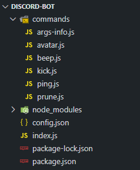
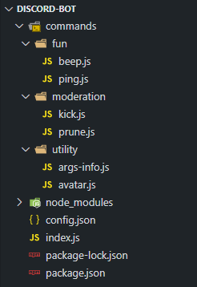

# Additional features

::: tip
This page is a follow-up and bases its code on [the previous page](/command-handling/).
:::

The command handler you've been building so far doesn't do much aside from dynamically load and execute commands. Those two things alone are great, but not the only things you want. Before diving into it, let's do some quick refactoring in preparation.

```js {2,4,6,9}
const args = message.content.slice(prefix.length).trim().split(/ +/);
const commandName = args.shift().toLowerCase();

if (!client.commands.has(commandName)) return;

const command = client.commands.get(commandName);

try {
	command.execute(message, args);
} catch (error) {
	// ...
}
```

In this short (but necessary) refactor, you:

1. Renamed the original `command` variable to `commandName` (to be descriptive and to be able to create a different `command` variable later).
2. Changed the following `if` statement appropriately.
3. Made a variable named `command`, which is the actual command object.
4. Changed the line inside the `try/catch` statement to use the `command` variable instead.

Now you can start adding features!

## Command categories

So far, all of your command files are in a single `commands` folder. This is fine at first, but as your project grows, the number of files in the `commands` folder will too. Keeping track of that many files can be a little tough. To make this a little easier, you can categorize your commands and put them in subfolders inside the `commands` folder. You will have to make a few changes to your existing code in `index.js` for this to work out.

If you've been following along, your project structure should look something like this:



After moving your commands into sub-folders, it will look something like this:



::: warning
Make sure you put every command file you have inside one of the new sub-folders. Leaving a command file directly under the `commands` folder will create problems.
:::

It is not necessary to name your subfolders exactly like we have named them here. You can create any number of subfolders and name them whatever you want. Although, it is a good practice to name them according to the type of commands stored inside them.

Back in your `index.js` file, where the code to [dynamically read command files](/command-handling/#reading-command-files) is, use the same pattern to read the sub-folder directories, and then require each command inside them.

```js {3,5-11}
client.commands = new Discord.Collection();

const commandFolders = fs.readdirSync('./commands');

for (const folder of commandFolders) {
	const commandFiles = fs.readdirSync(`./commands/${folder}`).filter(file => file.endsWith('.js'));
	for (const file of commandFiles) {
		const command = require(`./commands/${folder}/${file}`);
		client.commands.set(command.name, command);
	}
}
```

That's it! When creating new files for commands, make sure you create them inside one of the subfolders (or a new one) in the `commands` folder.

## Required arguments

For this section, we'll be using the `args-info.js` command as an example. If you chose to keep it, it should look like this now:

```js
module.exports = {
	name: 'args-info',
	description: 'Information about the arguments provided.',
	execute(message, args) {
		if (!args.length) {
			return message.channel.send(`You didn't provide any arguments, ${message.author}!`);
		} else if (args[0] === 'foo') {
			return message.channel.send('bar');
		}

		message.channel.send(`Arguments: ${args}\nArguments length: ${args.length}`);
	},
};
```

This check suffices if you only have a few commands that require arguments; however, if you plan on making a lot of commands and don't want to copy & paste that `if` statement each time, it'd be a smart idea to change that check into something more straightforward.

Here are the changes you'll be making:

```js {4,6-8}
module.exports = {
	name: 'args-info',
	description: 'Information about the arguments provided.',
	args: true,
	execute(message, args) {
		if (args[0] === 'foo') {
			return message.channel.send('bar');
		}

		message.channel.send(`Arguments: ${args}\nArguments length: ${args.length}`);
	},
};
```

And then in your main file:

```js {3-5}
const command = client.commands.get(commandName);

if (command.args && !args.length) {
	return message.channel.send(`You didn't provide any arguments, ${message.author}!`);
}
```

Now, whenever you set `args` to `true` in one of your command files, it'll perform this check and supply feedback if necessary.

### Expected command usage

It's good UX (user experience) to let the user know that a command requires arguments when they don't provide any (it also prevents your code from breaking). Letting them know what kind of arguments the command expects is even better.

Here's a simple implementation of such a thing. For this example, pretend you have a `!role` command, where the first argument is the user to give the role, and the second argument is the name of the role.

In your `role.js` file:

```js {3-4}
module.exports = {
	name: 'role',
	args: true,
	usage: '<user> <role>',
	execute(message, args) {
		// ...
	},
};
```

In your main file:

```js {2,4-6,8}
if (command.args && !args.length) {
	let reply = `You didn't provide any arguments, ${message.author}!`;

	if (command.usage) {
		reply += `\nThe proper usage would be: \`${prefix}${command.name} ${command.usage}\``;
	}

	return message.channel.send(reply);
}
```

## Guild only commands

Some commands are meant to be used only inside servers and won't work whatsoever in DMs. A prime example of this would be a kick command. You can add a property to the necessary commands to determine whether it should only be available outside of servers.

In the kick command you created in an earlier chapter, make the following changes:

```js {4}
module.exports = {
	name: 'kick',
	description: 'Kick a user from the server.',
	guildOnly: true,
	execute(message, args) {
		// ...
	},
};
```

And in your main file, use an if statement to verify:


```js {1-3}
if (command.guildOnly && message.channel.type === 'dm') {
	return message.reply('I can\'t execute that command inside DMs!');
}

if (command.args && !args.length) {
	// ...
}
```

Now when you try to use the kick command inside a DM, you'll get the appropriate response, preventing your bot from throwing an error.

<div is="discord-messages">
	<discord-message profile="user">
		!kick
	</discord-message>
	<discord-message profile="bot">
		I can't execute that command inside DMs!
	</discord-message>
</div>

## Cooldowns

Spam is something you generally want to avoid–especially if one of your commands requires calls to other APIs or takes a bit of time to build/send. Cooldowns are also a very common feature bot developers want to integrate into their projects, so let's get started on that!

First, add a cooldown key to one of your commands (we use the ping command here) exports. This determines how long the user will have to wait (in seconds) before using this specific command again.

```js {3}
module.exports = {
	name: 'ping',
	cooldown: 5,
	execute(message) {
		// ...
	},
};
```

In your main file, initialize an empty [Collection](/additional-info/collections.html) which you can then fill later when commands are used:

```js {2}
client.commands = new Discord.Collection();
client.cooldowns = new Discord.Collection();
```

The keys will be the command names, and the values will be Collections associating the user id (key) to the last time (value) this specific user used this specific command. Overall the logical path to get a specific user's last usage of a specific command will be `cooldowns > command > user > timestamp`.

In your main file, add the following code:

```js {1,3-5,7-9,11-13}
const { cooldowns } = client;

if (!cooldowns.has(command.name)) {
	cooldowns.set(command.name, new Discord.Collection());
}

const now = Date.now();
const timestamps = cooldowns.get(command.name);
const cooldownAmount = (command.cooldown || 3) * 1000;

if (timestamps.has(message.author.id)) {
	// ...
}

try {
	// ...
} catch (error) {
	// ...
}
```

You check if the `cooldowns` Collection already has an entry for the command being used right now. If this is not the case, add a new entry, where the value is initialized as an empty Collection. Next, 3 variables are created:

1. `now`: The current timestamp.
2. `timestamps`: A reference to the Collection of user-ID and timestamp key/value pairs for the triggered command.
3. `cooldownAmount`: The specified cooldown from the command file, converted to milliseconds for straightforward calculation. If none is specified, this defaults to three seconds.

If the author has already used this command in this session, get the timestamp, calculate the expiration time and inform the user of the amount of time they need to wait before using this command again. Note that you use a `return` statement here, causing the code below this snippet only to execute if the message author has not used this command in this session or the wait has already expired.

Continuing with your current setup, this is the complete `if` statement:

```js {2,4-7}
if (timestamps.has(message.author.id)) {
	const expirationTime = timestamps.get(message.author.id) + cooldownAmount;

	if (now < expirationTime) {
		const timeLeft = (expirationTime - now) / 1000;
		return message.reply(`please wait ${timeLeft.toFixed(1)} more second(s) before reusing the \`${command.name}\` command.`);
	}
}
```

Since the `timestamps` Collection has the author's ID in it as a key, you `.get()` it and then sum it up with the `cooldownAmount` variable to get the correct expiration timestamp. You then check to see if it's expired or not.

The previous author check serves as a precaution. It should normally not be necessary, as you will now insert a short piece of code, causing the author's entry to be deleted after the cooldown has expired. To facilitate this, you will use the node.js `setTimeout` method, which allows you to execute a function after a specified amount of time:

```js {5-6}
if (timestamps.has(message.author.id)) {
	// ...
}

timestamps.set(message.author.id, now);
setTimeout(() => timestamps.delete(message.author.id), cooldownAmount);
```

This line causes the entry for the message author under the specified command to be deleted after the command's cooldown time is expired for this user.

## Command aliases

It's a good idea to allow users to trigger your commands in more than one way; it gives them the freedom of choosing what to send and may even make some command names easier to remember. Luckily, setting up aliases for your commands is quite simple.

For this bit of the guide, we'll be using the avatar command as a target. Discord refers to your profile picture as an "avatar"; however, not everyone calls it that. Some people prefer "icon" or "pfp" (profile picture). With that in mind, let's update the avatar command to allow all three of those triggers.

Open your `avatar.js` file and add in the following line:

```js {3}
module.exports = {
	name: 'avatar',
	aliases: ['icon', 'pfp'],
	execute(message, args) {
		// ...
	},
};
```

The `aliases` property should always contain an array of strings. In your main file, here are the changes you'll need to make:

<!-- eslint-disable no-useless-return -->

```js {5-6,8}
client.on('message', message => {
	const args = message.content.slice(prefix.length).trim().split(/ +/);
	const commandName = args.shift().toLowerCase();

	const command = client.commands.get(commandName)
		|| client.commands.find(cmd => cmd.aliases && cmd.aliases.includes(commandName));

	if (!command) return;
	// ...
});
```

Making those two small changes, you get this:

<div is="discord-messages">
	<discord-message profile="user">
		!avatar <mention :highlight="true" profile="user" />
	</discord-message>
	<discord-message profile="bot">
		User's avatar:
		<a href="https://cdn.discordapp.com/avatars/328037144868290560/1cc0a3b14aec3499632225c708451d67.png" target="_blank" rel="noreferrer noopener">https://cdn.discordapp.com/avatars/328037144868290560/1cc0a3b14aec3499632225c708451d67.png</a>
		<br />
		
	</discord-message>
	<discord-message profile="user">
		!icon <mention :highlight="true" profile="user" />
	</discord-message>
	<discord-message profile="bot">
		User's avatar:
		<a href="https://cdn.discordapp.com/avatars/328037144868290560/1cc0a3b14aec3499632225c708451d67.png" target="_blank" rel="noreferrer noopener">https://cdn.discordapp.com/avatars/328037144868290560/1cc0a3b14aec3499632225c708451d67.png</a>
		<br />
		
	</discord-message>
</div>

## A dynamic help command

If you don't use a framework or command handler for your projects, you'll have a tough time setting up an always up-to-date help command. Luckily, that's not the case here. Start by creating a new command file inside your `commands` folder and populate it as you usually would.

```js
module.exports = {
	name: 'help',
	description: 'List all of my commands or info about a specific command.',
	aliases: ['commands'],
	usage: '[command name]',
	cooldown: 5,
	execute(message, args) {
		// ...
	},
};
```

You're going to need your prefix variable a couple of times inside this command, so make sure to require that at the very top of the file.

```js {1}
const { prefix } = require('../../config.json');

module.exports = {
	// ...
};
```

Inside the `execute()` function, set up some variables and an if/else statement to determine whether it should display a list of all the command names or only information about a specific command.

```js {4-5,7-9}
module.exports = {
	// ...
	execute(message, args) {
		const data = [];
		const { commands } = message.client;

		if (!args.length) {
			// ...
		}
	},
};
```

You can use `.push()` on the `data` variable to append the info you want and then DM it to the message author afterward.

```js {2-4,6-14}
if (!args.length) {
	data.push('Here\'s a list of all my commands:');
	data.push(commands.map(command => command.name).join(', '));
	data.push(`\nYou can send \`${prefix}help [command name]\` to get info on a specific command!`);

	return message.author.send(data, { split: true })
		.then(() => {
			if (message.channel.type === 'dm') return;
			message.reply('I\'ve sent you a DM with all my commands!');
		})
		.catch(error => {
			console.error(`Could not send help DM to ${message.author.tag}.\n`, error);
			message.reply('it seems like I can\'t DM you! Do you have DMs disabled?');
		});
}
```

There's nothing complicated here; all you do is append some strings, `.map()` over the `commands` Collection, and add a string to let the user know how to trigger information about a specific command.

Since help messages can get messy, you'll be DMing it to the message author instead of posting it in the requested channel. However, there is something significant you should consider: the possibility of not being able to DM the user, whether it be that they have DMs disabled on that server or overall, or they have the bot blocked. For that reason, you should `.catch()` it and let them know.

::: tip
If you weren't already aware, `.send()` takes two parameters: the content to send, and the message options to pass in. You can read about the `MessageOptions` type <docs-link path="typedef/MessageOptions">here</docs-link>. Using `split: true` here will automatically split our help message into two or more messages in the case that it exceeds the 2,000 character limit.
:::

::: tip
Because the `data` variable is an array, you can take advantage of discord.js' functionality where it will `.join()` any array sent with a `\n` character. If you prefer not to rely on that in the chance that it changes in the future, you can append `.join('\n')` to the end of that yourself.
:::

Below the `if (!args.length)` statement is where you'll send the help message for the command they specified.

```js {5-6,8-10,12,14-16,18,20}
if (!args.length) {
	// ...
}

const name = args[0].toLowerCase();
const command = commands.get(name) || commands.find(c => c.aliases && c.aliases.includes(name));

if (!command) {
	return message.reply('that\'s not a valid command!');
}

data.push(`**Name:** ${command.name}`);

if (command.aliases) data.push(`**Aliases:** ${command.aliases.join(', ')}`);
if (command.description) data.push(`**Description:** ${command.description}`);
if (command.usage) data.push(`**Usage:** ${prefix}${command.name} ${command.usage}`);

data.push(`**Cooldown:** ${command.cooldown || 3} second(s)`);

message.channel.send(data, { split: true });
```

Once you get the command based on the name or alias they gave, you can start `.push()`ing what you need into the `data` variable. Not all commands will have descriptions, aliases, or usage strings, so you use an if statement for each of those to append them conditionally. After that, send back all the relevant information.

At the end of it all, you should be getting this as a result:

<div is="discord-messages">
	<discord-message profile="user">
		!help
	</discord-message>
	<discord-message profile="bot">
		Here's a list of all my commands:
		args-info, avatar, beep, help, kick, ping, prune, server, user-info <br>
		You can send `!help [command name]` to get info on a specific command!
	</discord-message>
	<discord-message profile="user">
		!help avatar
	</discord-message>
	<discord-message profile="bot">
		<strong>Name:</strong> avatar <br>
		<strong>Aliases:</strong> icon,pfp <br>
		<strong>Description:</strong> Get the avatar URL of the tagged user(s), or your own avatar. <br>
		<strong>Cooldown:</strong> 3 second(s)
	</discord-message>
</div>

No more manually editing your help command! If you aren't satisfied with how it looks, you can always adjust it to your liking later.

::: tip
If you want to add categories or other information to your commands, you can add properties reflecting it to your `module.exports`. If you only want to show a subset of commands remember that `commands` is a Collection you can <branch version="11.x" inline><docs-link path="class/Collection?scrollTo=filter">filter</docs-link></branch><branch version="12.x" inline><docs-link section="collection" path="class/Collection?scrollTo=filter">filter</docs-link></branch> to fit your specific needs!
:::

## Command permissions

In this section, you will be adding permission requirements to the command handler we established so far. To do so, you need to add a `permissions` key to your existing command options. We will use the 'kick' command to demonstrate:

```js {5}
module.exports = {
	name: 'kick',
	description: 'Kick a user from the server.',
	guildOnly: true,
	permissions: 'KICK_MEMBERS',
	execute(message, args) {
		// ...
	},
};
```

You also need to check for those permissions before executing the command, which is done in the main file, as shown below. We use `TextChannel#permissionsFor` combined with `Permissions#has` rather than `Guildmember#hasPermission` to respect permission overwrites in our check.

```js {1-6}
if (command.permissions) {
	const authorPerms = message.channel.permissionsFor(message.author);
	if (!authorPerms || !authorPerms.has(command.permissions)) {
		return message.reply('You can not do this!');
	}
}

if (command.args && !args.length) {
	// ...
}
```

Your command handler will now refuse to execute commands if the permissions you specify in the command structure are missing from the member trying to use it. Note that the `ADMINISTRATOR` permission and the message author being the owner of the guild will overwrite this.

::: tip
Need more resources on how Discord's permission system works? Check the [permissions article](/popular-topics/permissions.html), [extended permissions knowledge base](/popular-topics/permissions-extended.html) and documentation of <docs-link path="class/Permissions?scrollTo=s-FLAGS">permission flags</docs-link> out! 
:::

## Reloading commands

When writing your commands, you may find it tedious to restart your bot every time you want to test even your code's slightest change. However, a single bot command can reload commands if you have a command handler.

Create a new command file and paste in the usual format (using the [argument checker](/command-handling/adding-features.html#required-arguments) from above) with a slight change:

```js {1}
const fs = require('fs');

module.exports = {
	name: 'reload',
	description: 'Reloads a command',
	args: true,
	execute(message, args) {
		// ...
	},
};
```

In this command, you will be using a command name or alias as the only argument. First off, you need to check if the command you want to reload exists. You can do this check similarly to getting a command in your main file:

```js {4-6,8-10}
module.exports = {
	// ...
	execute(message, args) {
		const commandName = args[0].toLowerCase();
		const command = message.client.commands.get(commandName)
			|| message.client.commands.find(cmd => cmd.aliases && cmd.aliases.includes(commandName));

		if (!command) {
			return message.channel.send(`There is no command with name or alias \`${commandName}\`, ${message.author}!`);
		}
	},
};
```

To build the correct file path, you will need the file name and the sub-folder the command belongs to. For the file name, you can use `command.name`. To find the sub-folder name, you will have to loop through the commands sub-folders and check whether the command file is in that folder or not. You can do that by using `Array.includes()` on each subfolder's file names array. 

```js {5-6}
if (!command) {
	// ...
}

const commandFolders = fs.readdirSync('./commands');
const folderName = commandFolders.find(folder => fs.readdirSync(`./commands/${folder}`).includes(`${command.name}.js`));
```

In theory, all there is to do is delete the previous command from `client.commands` and require the file again. In practice, you cannot do this easily as `require()` caches the file. If you were to require it again, you would load the previously cached file without any changes. You first need to delete the file from the `require.cache`, and only then should you require and set the command file to `client.commands`:

```js {3,5-12}
const folderName = commandFolders.find(folder => fs.readdirSync(`./commands/${folder}`).includes(`${commandName}.js`));

delete require.cache[require.resolve(`../${folderName}/${command.name}.js`)];

try {
	const newCommand = require(`../${folderName}/${command.name}.js`);
	message.client.commands.set(newCommand.name, newCommand);
	message.channel.send(`Command \`${newCommand.name}\` was reloaded!`);
} catch (error) {
	console.error(error);
	message.channel.send(`There was an error while reloading a command \`${command.name}\`:\n\`${error.message}\``);
}
```

The snippet above uses a `try/catch` block to load the command file and add it to `client.commands`. In case of an error, it will log the full error to the console and notify the user about it with the error's message component `error.message`. Note that you never actually delete the command from the commands Collection and instead overwrite it. This behavior prevents you from deleting a command and ending up with no command at all after a failed `require()` call, as each use of the reload command checks that Collection again.

## Conclusion 

You should have a command handler with some basic (but useful) features at this point in the guide! If you see fit, you can expand upon the current structure to make something even better and more comfortable for your future use.

## Resulting code

<resulting-code />
