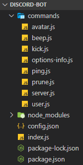
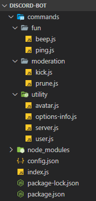

# Command handling

Unless your bot project is small, it's not a very good idea to have a single file with a giant `if`/`else if` chain for commands. If you want to implement features into your bot and make your development process a lot less painful, you'll want to implement a command handler. Let's get started on that!

::: tip
For fully functional slash commands, there are three important pieces of code that need to be written. They are:

1. The [individual command files](slash-commands), containing their definitions and functionality.
2. The command handler, which dynamically reads the files and executes the commands.
3. The [command deployment script](command-deployment), to register your slash commands with Discord so they appear in the interface.

These steps can be done in any order, but **all are required** before the commands are fully functional.

This page details how to complete **Step 2**. Make sure to also complete the other pages linked above!
:::

## Loading command files

Now that your command files have been created, your bot needs to load these files on startup. 

In your `index.js` file, make these additions to the base template:

```js {1-3,8}
const fs = require('node:fs');
const path = require('node:path');
const { Client, Collection, Events, GatewayIntentBits } = require('discord.js');
const { token } = require('./config.json');

const client = new Client({ intents: [GatewayIntentBits.Guilds] });

client.commands = new Collection();
```

We recommend attaching a `.commands` property to your client instance so that you can access your commands in other files. The rest of the examples in this guide will follow this convention. For TypeScript users, we recommend extending the base Client class to add this property, [casting](https://www.typescripttutorial.net/typescript-tutorial/type-casting/), or [augmenting the module type](https://www.typescriptlang.org/docs/handbook/modules.html#ambient-modules).

::: tip
- The [`fs`](https://nodejs.org/api/fs.html) module is Node's native file system module. `fs` is used to read the `commands` directory and identify our command files.
- The [`path`](https://nodejs.org/api/path.html) module is Node's native path utility module. `path` helps construct paths to access files and directories. One of the advantages of the `path` module is that it automatically detects the operating system and uses the appropriate joiners.
- The <DocsLink section="collection" path="Collection:Class" /> class extends JavaScript's native [`Map`](https://developer.mozilla.org/en-US/docs/Web/JavaScript/Reference/Global_Objects/Map) class, and includes more extensive, useful functionality. `Collection` is used to store and efficiently retrieve commands for execution.
:::

Next, using the modules imported above, dynamically retrieve your command files with a few more additions to the `index.js` file:

```js {3-15}
client.commands = new Collection();

const commandsPath = path.join(__dirname, 'commands');
const commandFiles = fs.readdirSync(commandsPath).filter(file => file.endsWith('.js'));

for (const file of commandFiles) {
	const filePath = path.join(commandsPath, file);
	const command = require(filePath);
	// Set a new item in the Collection with the key as the command name and the value as the exported module
	if ('data' in command && 'execute' in command) {
		client.commands.set(command.data.name, command);
	} else {
		console.log(`[WARNING] The command at ${filePath} is missing a required "data" or "execute" property.`);
	}
}
```

First, [`path.join()`](https://nodejs.org/api/path.html) helps to construct a path to the `commands` directory. The [`fs.readdirSync()`](https://nodejs.org/api/fs.html#fs_fs_readdirsync_path_options) method then reads the path to the directory and returns an array of all the file names it contains, currently `['ping.js', 'server.js', 'user.js']`. To ensure only command files get processed, `Array.filter()` removes any non-JavaScript files from the array. 

With the correct files identified, the last step is to loop over the array and dynamically set each command into the `client.commands` Collection. For each file being loaded, check that it has at least the `data` and `execute` properties. This helps to prevent errors resulting from loading empty, unfinished or otherwise incorrect command files while you're still developing.

## Receiving command interactions

Every slash command is an `interaction`, so to respond to a command, you need to create a listener for the <DocsLink path="class/Client?scrollTo=e-interactionCreate" /> event that will execute code when your application receives an interaction. Place the code below in the `index.js` file you created earlier.

```js
client.on(Events.InteractionCreate, interaction => {
	console.log(interaction);
});
```

Not every interaction is a slash command (e.g. `MessageComponent` interactions). Make sure to only handle slash commands in this function by making use of the <DocsLink path="class/BaseInteraction?scrollTo=isChatInputCommand" type="method"/> method to exit the handler if another type is encountered. This method also provides typeguarding for TypeScript users, narrowing the type from `BaseInteraction` to <DocsLink path="class/ChatInputCommandInteraction" />.

```js {2}
client.on(Events.InteractionCreate, interaction => {
	if (!interaction.isChatInputCommand()) return;
	console.log(interaction);
});
```

## Executing commands

When your bot receives a <DocsLink path="class/Client?scrollTo=e-interactionCreate" /> event, the interaction object contains all the information you need to dynamically retrieve and execute your commands!

Let's take a look at the `ping` command again. Note the `execute()` function that will reply to the interaction with "Pong!".

```js
module.exports = {
	data: new SlashCommandBuilder()
		.setName('ping')
		.setDescription('Replies with Pong!'),
	async execute(interaction) {
		await interaction.reply('Pong!');
	},
};
```

First, you need to get the matching command from the `client.commands` Collection based on the `interaction.commandName`. Your <DocsLink path="class/Client"/> instance is always available via `interaction.client`. If no matching command is found, log an error to the console and ignore the event.

With the right command identified, all that's left to do is call the command's `.execute()` method and pass in the `interaction` variable as its argument. In case something goes wrong, catch and log any error to the console.

```js {1,4-20}
client.on(Events.InteractionCreate, async interaction => {
	if (!interaction.isChatInputCommand()) return;

	const command = interaction.client.commands.get(interaction.commandName);

	if (!command) {
		console.error(`No command matching ${interaction.commandName} was found.`);
		return;
	}

	try {
		await command.execute(interaction);
	} catch (error) {
		console.error(error);
		if (interaction.replied || interaction.deferred) {
			await interaction.followUp({ content: 'There was an error while executing this command!', ephemeral: true });
		} else {
			await interaction.reply({ content: 'There was an error while executing this command!', ephemeral: true });
		}
	}
});
```

## Command categories

So far, all of your command files are in a single `commands` folder. This is fine at first, but as your project grows, the number of files in the `commands` folder will too. Keeping track of that many files can be a little tough. To make this a little easier, you can categorize your commands and put them in subfolders inside the `commands` folder. You will have to make a few changes to your existing code in `index.js` for this to work out.

If you've been following along, your project structure should look something like this:



After moving your commands into subfolders, it will look something like this:



::: warning
Make sure you put every command file you have inside one of the new subfolders. Leaving a command file directly under the `commands` folder will create problems.
:::

It is not necessary to name your subfolders exactly like we have named them here. You can create any number of subfolders and name them whatever you want. Although, it is a good practice to name them according to the type of commands stored inside them.

Back in your `index.js` file, where the code to [dynamically read command files](#loading-command-files) is, use the same pattern to read the subfolder directories, and then require each command inside them.

```js {3,6-13}
client.commands = new Collection();
const foldersPath = path.join(__dirname, 'commands');
const commandFolders = fs.readdirSync(foldersPath);

for (const folder of commandFolders) {
	const commandsPath = path.join(foldersPath, folder);
	const commandFiles = fs.readdirSync(commandsPath).filter(file => file.endsWith('.js'));
	for (const file of commandFiles) {
		const filePath = path.join(commandsPath, file);
		const command = require(filePath);
		// Set a new item in the Collection with the key as the command name and the value as the exported module
		if ('data' in command && 'execute' in command) {
			client.commands.set(command.data.name, command);
		} else {
			console.log(`[WARNING] The command at ${filePath} is missing a required "data" or "execute" property.`);
		}
	}
}
```

That's it! When creating new files for commands, make sure you create them inside one of the subfolders (or a new one) in the `commands` folder.

#### Next steps

Your command files are now loaded into your bot, and the event listener is prepared and ready to respond. In the next section, we cover the final step - a command deployment script you'll need to register your commands so they appear in the Discord client.

#### Resulting code

<ResultingCode path="creating-your-bot/command-handling" />

It also includes some bonus commands!
