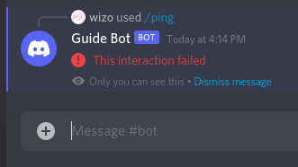

# Creating commands

::: tip
This page is a follow-up and bases its code on [the previous page](/creating-your-bot/).
:::

<DiscordMessages>
	<DiscordMessage profile="bot">
		<template #interactions>
			<DiscordInteraction profile="user" :command="true">ping</DiscordInteraction>
		</template>
		Pong!
	</DiscordMessage>
</DiscordMessages>

Discord allows developers to register [slash commands](https://discord.com/developers/docs/interactions/application-commands), which provide users a first-class way of interacting directly with your application. Before being able to reply to a command, you must first register it.

To make slash commands work, you need to do two things:

1. **Register the structure of the slash command**: In this step, you are essentially telling Discord:
> "Show *these* commands to the user when they type `/` in the chat."
2. **Reply to the slash command**: In this step, you decide *what* and *how* to reply to the user who used your slash command. This is essentially your "bot" (the `index.js` that you've created so far).

::: warning
You only need to register the structure of your slash sommands once. You can edit the structure of a slash command by registering it again with a new structure. You will see what we mean by "structure" in the next section.
:::

This page will only cover the bare minimum to get you started, but you can refer to our [in-depth page on slash commands](/interactions/registering-slash-commands.md) for a more detailed guide.

## Registering slash commands

As we mentioned earlier, you only have to register the structure of your slash commands once. As such, we strongly recommend creating a separate `deploy-commands.js` file in your project directory. This file will be used to register, edit, and delete slash commands for your bot application.

```:no-line-numbers {4}
discord-bot/
├── node_modules
├── config.json
├── deploy-commands.js // <-- Create a new file named deploy-commands.js
├── index.js
├── package-lock.json
└── package.json
```

Next, you'll need to install [`@discordjs/builders`](https://github.com/discordjs/builders), [`@discordjs/rest`](https://github.com/discordjs/discord.js-modules/blob/main/packages/rest/), and [`discord-api-types`](https://github.com/discordjs/discord-api-types/).

```sh:no-line-numbers
npm install @discordjs/builders @discordjs/rest discord-api-types
```

Let's suppose you want to register these three slash commands for your bot: `/ping`, `/server`, and `/user`.


Here's what your `deploy-commands.js` will look like:
:::: code-group
::: code-group-item deploy-commands.js
```js{4,6-11,17-21}
const { SlashCommandBuilder } = require('@discordjs/builders');
const { REST } = require('@discordjs/rest');
const { Routes } = require('discord-api-types/v9');
const { clientId, guildId, token } = require('./config.json');

// Define an array with three slash commands structure
const commands = [
	new SlashCommandBuilder().setName('ping').setDescription('Replies with pong!'),
	new SlashCommandBuilder().setName('server').setDescription('Replies with server info!'),
	new SlashCommandBuilder().setName('user').setDescription('Replies with user info!'),
].map(command => command.toJSON());

const rest = new REST({ version: '9' }).setToken(token);

(async () => {
	try {
		// Register the array of slash commands with res.put()
		await rest.put(
			Routes.applicationGuildCommands(clientId, guildId),
			{ body: commands },
		);

		console.log('Successfully registered application commands.');
	} catch (error) {
		console.error(error);
	}
})();
```
:::
::: code-group-item config.json
```json {2-3}
{
	"clientId": "123456789012345678",
	"guildId": "876543210987654321",
	"token": "your-token-goes-here"
}
```
:::
::::

Focus on these variables:

- `clientId`: Your client's id
- `guildId`: Your development server's id
- `commands`: An array of commands to register. 

The [`SlashCommandBuilder()`](/popular-topics/builders.md#Slash-command-builders) is used to build the structure for your commands. As you can see from the script above, the structure of the `/ping` command has a name `ping` and a description `Replies with pong!`. The structure can include other things such as subcommand, options, choices, permission, etc. You can refer to our [in-depth page on slash commands](/interactions/registering-slash-commands.md) to learn more about it.

::: tip
In order to get your client and guild ids, open Discord and go to your settings. On the "Advanced" page, turn on "Developer Mode". This will enable a "Copy ID" button in the context menu when you right-click on a server icon, a user's profile, etc.
:::

Once you fill in those variables, run:
```sh:no-line-numbers
node deploy-commands.js
``` 
in your project directory to register the structure of your slash commands to your specified guild.

Congratulations! 🎉

You've successfully registered your slash commands. Go ahead and type `/` in your guild and you should be able to see your slash commands already:


::: warning
Once your commands have been registered, they will "stay" in Discord. Anything you do in your `deploy-commands.js` file after this point will **NOT** affect the commands that have been registered already. 

If you do any of the following:
- Add a new command to the `commands` array
- Edit an existing command's structure (e.g. changing `setDescription('Replies with pong!')` to `setDescription('some random description')`)
- Remove a command from the `commands` array

you will need to run `node deploy-commands.js` again to register the "new" set of commands to Discord.
:::

## Replying to slash commands

Once you've registered your slash commands, you can reply to them with your bot. Let's go back to your `index.js` file, and add these lines:

:::: code-group
::: code-group-item index.js
```js {13-15}
const { Client, Intents } = require('discord.js');
const { token } = require('./config.json');

const client = new Client({ intents: [Intents.FLAGS.GUILDS] });

client.once('ready', () => {
	console.log('Ready!');
});

client.on('interactionCreate', async interaction => {
	console.log(interaction)
});

client.login(token);
```
:::
::::

A slash command is just one type of [interaction](https://discord.com/developers/docs/interactions/application-commands#Slash-commands). Therefore, you can make your bot listen to the [`interactionCreate`](https://discord.js.org/#/docs/main/stable/class/Client?scrollTo=e-interactionCreate) event to receive incoming interactions. Let's log the incoming interaction with `console.log(interaction)` to make sure your bot is working properly. Go ahead and start the bot with:

```sh:no-line-numbers
node index.js
```

and then use the `/ping` command in your guild. You should see something logged in your terminal that is similar to this:

```:no-line-numbers
CommandInteraction {
  type: 'APPLICATION_COMMAND',
  id: '123',
  applicationId: '123',
  channelId: '123',
  guildId: '123',
  user: User { ... },
  member: GuildMember { ... },
  version: 1,
  commandId: '123',
  commandName: 'ping',
  deferred: false,
  options: CommandInteractionOptionResolver {
    _group: null,
    _subcommand: null,
    _hoistedOptions: []
  },
  replied: false,
  ephemeral: null,
  webhook: InteractionWebhook { id: '123' }
}
```

If you see something like that getting logged in your terminal, then that means your bot is receiving the interaction event correctly! However, your bot hasn't replied to the interaction yet, which is why you will see something like this in your Discord:



Let's go ahead and fix that by making these changes inside the callback:

:::: code-group
::: code-group-item index.js
```js {14-22}
const { Client, Intents } = require('discord.js');
const { token } = require('./config.json');

const client = new Client({ intents: [Intents.FLAGS.GUILDS] });

client.once('ready', () => {
	console.log('Ready!');
});

client.on('interactionCreate', async interaction => {
	if (!interaction.isCommand()) return;

	if (interaction.commandName === 'ping') {
		await interaction.reply('Pong!');
	} else if (interaction.commandName === 'server') {
		await interaction.reply(`Server name: ${interaction.guild.name}\nTotal members: ${interaction.guild.memberCount}`);
	} else if (interaction.commandName === 'user') {
		await interaction.reply(`Your tag: ${interaction.user.tag}\nYour id: ${interaction.user.id}`);
	}
});

client.login(token);
```
:::
::::

As we mentioned earlier, a slash command is just one type of interaction. Therefore, you should first check if the interaction is a slash command by calling `.isCommand()`. Next, you should check the name of the command by accessing the `.commandName` property. Finally, you reply to the interaction by calling `.reply()`.

::: warning
You must reply to the interaction within **three seconds** of receiving it.
:::

For the `ping` command, you simply reply back with a `Pong!` message.

For the `server` command, you can access the `.guild` property, which refers to the guild the interaction was sent in. Note that Discord servers are referred to as "guilds" in the Discord API and discord.js library. This `.guild` is an instance of [Guild](https://discord.js.org/#/docs/main/stable/class/Guild) which exposes properties such as `.name` and `.memberCount`.

::: tip
Refer to the <DocsLink path="class/Guild" /> documentation for a list of all the available properties and methods!
:::

For the `user` command, you can access the `.user` property, which refers to the user who used the command. This `.user` is an instance of [User](https://discord.js.org/#/docs/main/stable/class/User) which exposes properties such as `.tag` and `.id`.

::: tip
Refer to the <DocsLink path="class/User" /> documentation for a list of all the available properties and methods!
:::

Now that you have it fixed, let's start the bot again:
```sh:no-line-numbers
node index.js
```
and then use the `/ping` command in your guild. This time, you should see something like this instead:

<DiscordMessages>
	<DiscordMessage profile="bot">
		<template #interactions>
			<DiscordInteraction profile="user" :command="true">ping</DiscordInteraction>
		</template>
		Pong!
	</DiscordMessage>
</DiscordMessages>

Congratulations! 🎉

You now have three working slash commands. Go ahead and try out `/server` and `/user` as well. 

Your `/server` should look like this:

<DiscordMessages>
	<DiscordMessage profile="bot">
		<template #interactions>
			<DiscordInteraction profile="user" :command="true">server</DiscordInteraction>
		</template>
		Server name: Discord.js Guide
		<br />
		Total members: 2
	</DiscordMessage>
</DiscordMessages>

And your `/user` should look like this:

<DiscordMessages>
	<DiscordMessage profile="bot">
		<template #interactions>
			<DiscordInteraction profile="user" :command="true">user</DiscordInteraction>
		</template>
		Your tag: User#0001
		<br />
		Your id: 123456789012345678
	</DiscordMessage>
</DiscordMessages>

And there you have it!

## The problem with `if`/`else if`

If you don't plan on making more than a couple commands, then using an `if`/`else if` chain is fine; however, this isn't always the case. Using a giant `if`/`else if` chain will only hinder your development process in the long run.

Here's a small list of reasons why you shouldn't do so:

* Takes longer to find a piece of code you want;
* Easier to fall victim to [spaghetti code](https://en.wikipedia.org/wiki/Spaghetti_code);
* Difficult to maintain as it grows;
* Difficult to debug;
* Difficult to organize;
* General bad practice.

Next, we'll be diving into something called a "command handler"–code that makes handling commands easier and much more efficient. This allows you to move your commands into individual files.

## Resulting code

<ResultingCode />
