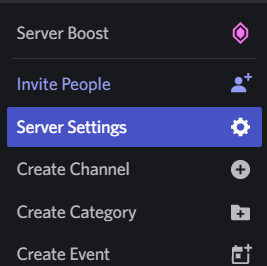
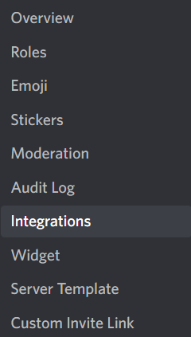

# Deleting commands

::: tip
This page is a follow-up to [the previous page](./creating-commands.md). You need commands to delete them in the first place.
:::

You may have decided that you don't need a command anymore, and you don't want the user experience to be confusing when they encounter a removed command. 

Fortunately, Discord allows you to delete commands in their specific context.

## Deleting specific commands

You can delete a specific command by getting the ID of an application command. Head to **Server Settings -> Integrations -> Bots and Apps** and choose your bot. Then, you can right click a command and click **Copy ID** to get it's ID.





::: tip
You need to have Developer Mode enabled to copy an application's ID
:::

### Command deployment script

Edit your `deploy-commands.js` file and add the following:

```js
const { Routes } = require('discord-api-types/v9');
const REST = require('@discordjs/rest');

const rest = new REST({ version: '9' }).setToken(token);

rest.delete(Routes.applicationGuildCommand(clientId, guildId, commandId))
    .then(() => console.log('Successfully deleted guild command'))
    .catch(console.error);
// or
rest.delete(Routes.applicationCommand(clientId, commandId))
    .then(() => console.log('Successfully deleted application command'))
    .catch(console.error);
```
Where `commandId` is the ID of the command you want to delete. Run your deploy script and it will delete the command.

### Deleting all commands

You can pass an empty array when setting commands to overwrite all existing commands.

```js
const { Routes } = require('discord-api-types/v9');
const REST = require('@discordjs/rest');

const rest = new REST({ version: '9' }).setToken(token);

rest.put(Routes.applicationGuildCommands(clientId, guildId), { body: [] })
    .then(() => console.log('Successfully deleted all guild commands.'))
    .catch(console.error);
// or
rest.put(Routes.applicationCommands(clientId), { body: [] })
    .then(() => console.log('Successfully deleted all application commands.'))
    .catch(console.error);
```