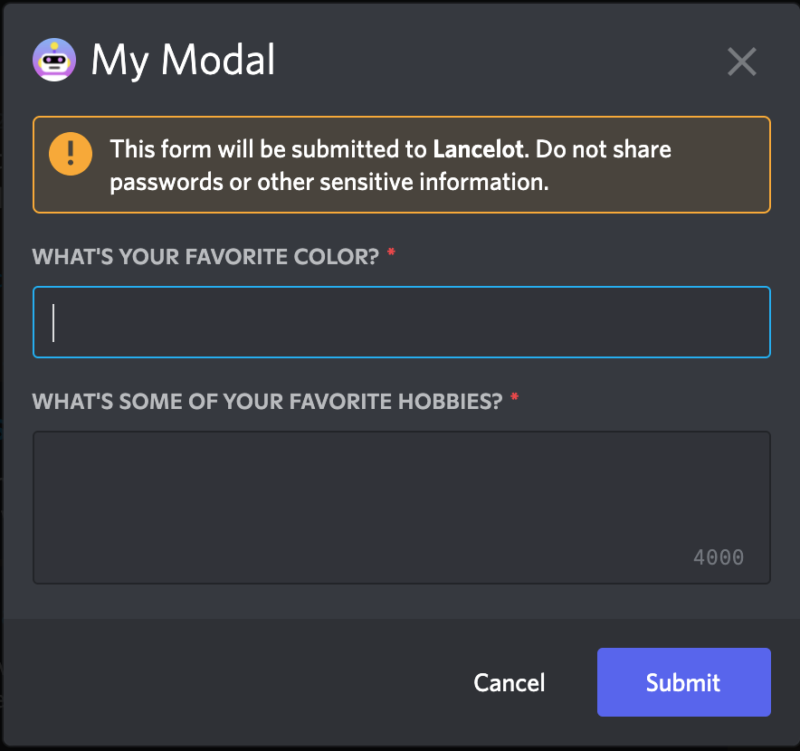

# Modals

With modals you can create pop-up forms that allow users to provide you with formatted inputs through submissions. We'll cover how to create, show, and receive modal forms using discord.js!

::: tip
This page is a follow-up to the [interactions (slash commands) page](/slash-commands/advanced-creation.md). Please carefully read that section first, so that you can understand the methods used in this section.
:::

## Building and responding with modals

Unlike message components, modals aren't strictly components themselves. They're a callback structure used to respond to interactions.

::: tip
You can have a maximum of five <DocsLink path="class/ActionRowBuilder" />s per modal builder, and one <DocsLink path="class/TextInputBuilder" /> within an <DocsLink path="class/ActionRowBuilder" />. Currently, you can only use <DocsLink path="class/TextInputBuilder" />s in modal action rows builders.
:::

To create a modal you construct a new <DocsLink path="class/ModalBuilder" />. You can then use the setters to add the custom id and title.

```js {1,7-13}
const { Events, ModalBuilder } = require('discord.js');

client.on(Events.InteractionCreate, async interaction => {
	if (!interaction.isChatInputCommand()) return;

	if (interaction.commandName === 'ping') {
		const modal = new ModalBuilder()
			.setCustomId('myModal')
			.setTitle('My Modal');

		// TODO: Add components to modal...
	}
});
```
::: tip
The custom id is a developer-defined string of up to 100 characters. Use this field to ensure you can uniquely define all incoming interactions from your modals!
:::

The next step is to add the input fields in which users responding can enter free-text. Adding inputs is similar to adding components to messages.

At the end, we then call <DocsLink path="class/ChatInputCommandInteraction?scrollTo=showModal" type="method"/> to display the modal to the user.

::: warning
If you're using typescript you'll need to specify the type of components your action row holds. This can be done by specifying the generic parameter in <DocsLink path="class/ActionRowBuilder" />

```diff
- new ActionRowBuilder()
+ new ActionRowBuilder<ModalActionRowComponentBuilder>()
```
:::

```js {1,12-34}
const { ActionRowBuilder, Events, ModalBuilder, TextInputBuilder, TextInputStyle } = require('discord.js');

client.on(Events.InteractionCreate, async interaction => {
	if (!interaction.isChatInputCommand()) return;

	if (interaction.commandName === 'ping') {
		// Create the modal
		const modal = new ModalBuilder()
			.setCustomId('myModal')
			.setTitle('My Modal');

		// Add components to modal

		// Create the text input components
		const favoriteColorInput = new TextInputBuilder()
			.setCustomId('favoriteColorInput')
		    // The label is the prompt the user sees for this input
			.setLabel("What's your favorite color?")
		    // Short means only a single line of text
			.setStyle(TextInputStyle.Short);

		const hobbiesInput = new TextInputBuilder()
			.setCustomId('hobbiesInput')
			.setLabel("What's some of your favorite hobbies?")
		    // Paragraph means multiple lines of text.
			.setStyle(TextInputStyle.Paragraph);

		// An action row only holds one text input,
		// so you need one action row per text input.
		const firstActionRow = new ActionRowBuilder().addComponents(favoriteColorInput);
		const secondActionRow = new ActionRowBuilder().addComponents(hobbiesInput);

		// Add inputs to the modal
		modal.addComponents(firstActionRow, secondActionRow);

		// Show the modal to the user
		await interaction.showModal(modal);
	}
});
```

Restart your bot and invoke the `/ping` command again. You should see a popup form resembling the image below:



::: warning
Showing a modal must be the first response to an interaction. You cannot `defer()` or `deferUpdate()` then show a modal later.
:::

### Input styles

Currently there are two different input styles available:
- `Short`, a single-line text entry;
- `Paragraph`, a multi-line text entry similar to the HTML `<textarea>`;

### Input properties

In addition to the `customId`, `label` and `style`, a text input can be customised in a number of ways to apply validation, prompt the user, or set default values via the <DocsLink path="class/TextInputBuilder" /> methods:

```js
const input = new TextInputBuilder()
	// set the maximum number of characters to allow
	.setMaxLength(1000)
	// set the minimum number of characters required for submission
	.setMinLength(10)
	// set a placeholder string to prompt the user
	.setPlaceholder('Enter some text!')
	// set a default value to pre-fill the input
	.setValue('Default')
	 // require a value in this input field
	.setRequired(true);
```

## Receiving modal submissions

### Interaction collectors

Modal submissions can be collected within the scope of the interaction that showed it by utilising an <DocsLink path="class/InteractionCollector"/>, or the <DocsLink path="class/ChatInputCommandInteraction?scrollTo=awaitModalSubmit" type="method"/> promisified method. These both provide instances of the <DocsLink path="class/ModalSubmitInteraction"/> class as collected items.

For a detailed guide on receiving message components via collectors, please refer to the [collectors guide](/popular-topics/collectors.md#interaction-collectors).

### The interactionCreate event

To receive a <DocsLink path="class/ModalSubmitInteraction"/> event, attach an <DocsLink path="class/Client?scrollTo=e-interactionCreate"/> event listener to your client and use the <DocsLink path="class/BaseInteraction?scrollTo=isModalSubmit" type="method"/> type guard to make sure you only receive modals:

```js {1,4}
client.on(Events.InteractionCreate, interaction => {
	if (!interaction.isModalSubmit()) return;
	console.log(interaction);
});
```

## Responding to modal submissions

The <DocsLink path="class/ModalSubmitInteraction"/> class provides the same methods as the <DocsLink path="class/ChatInputCommandInteraction"/> class. These methods behave equally:
- `reply()`
- `editReply()`
- `deferReply()`
- `fetchReply()`
- `deleteReply()`
- `followUp()`

If the modal was shown from a <DocsLink path="class/ButtonInteraction"/> or <DocsLink path="class/StringSelectMenuInteraction"/>, it will also provide these methods, which behave equally:
- `update()`
- `deferUpdate()`

```js{1,3-5}
client.on(Events.InteractionCreate, async interaction => {
	if (!interaction.isModalSubmit()) return;
	if (interaction.customId === 'myModal') {
		await interaction.reply({ content: 'Your submission was received successfully!' });
	}
});
```

::: tip
If you're using typescript, you can use the <DocsLink path="class/ModalSubmitInteraction?scrollTo=isFromMessage" type="method"/> typeguard, to make sure the received interaction was from a `MessageComponentInteraction`.
:::

## Extracting data from modal submissions

You'll most likely need to read the data sent by the user in the modal. You can do this by accessing the <DocsLink path="class/ModalSubmitInteraction?scrollTo=fields"/>. From there you can call <DocsLink path="class/ModalSubmitFields?scrollTo=getTextInputValue" type="method"/> with the custom id of the text input to get the value.

```js{5-7}
client.on(Events.InteractionCreate, interaction => {
	if (!interaction.isModalSubmit()) return;

	// Get the data entered by the user
	const favoriteColor = interaction.fields.getTextInputValue('favoriteColorInput');
	const hobbies = interaction.fields.getTextInputValue('hobbiesInput');
	console.log({ favoriteColor, hobbies });
});
```
