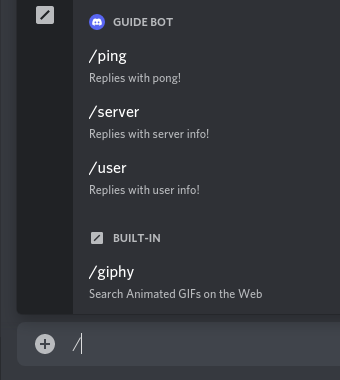
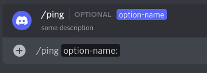
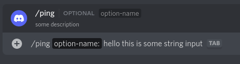
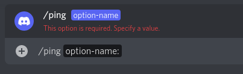
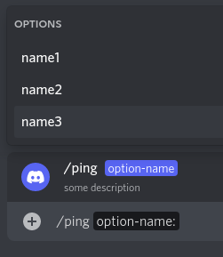
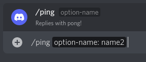
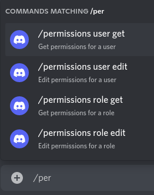
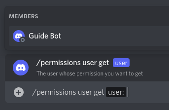

# Slash commands

::: warning
This page will **NOT** be using the command handler version of the `index.js` and `deploy-commands.js` files for the sake of simplicity during explanation. However, all the concepts and examples in this page are also applicable for the command handler version of the aformentioned files.
:::

## What are slash commands?

Discord provides developers with the option to create client-integrated slash commands.

Here is a quick 1 minute explanation video from Discord:

<iframe width="854" height="480" src="https://www.youtube.com/embed/4XxcpBxSCiU?fs=0&modestbranding=1&rel=0" frameborder="0"></iframe>

If you want a more technical explanation, you can read the [blog post by Discord](https://blog.discord.com/slash-commands-are-here-8db0a385d9e6).

You can also always refer to [Discord's official documentation](https://discord.com/developers/docs/interactions/application-commands).

In this page, we'll cover how to make them work using discord.js!

To make slash commands work, we need to do two things:

1. **Register the structure of the slash command**: We will be creating a separate file called `deploy-commands.js` for registration. In this step, we are essentially telling Discord:
> "Show *these* commands to the user when they type `/` in the chat."

2. **Reply to the slash command**: In this step, we decide *what* and *how* to reply to the user who used our slash command. This is essentially the "bot" itself (the `index.js`).

::: warning
You only need to register the *structure* of your slash commands **ONCE**. We will see what we mean by "*structure*" in the next section.

Once your commands have been registered, they will "stay" in Discord. Anything you do in your local file after this point will **NOT** affect the commands that have been registered already. You can even delete your `deploy-commands.js` file and it won't affect the commands that have been registered already.

If you do any of the following in your **local files**:
- Add a new command
- Edit an existing command's structure (e.g. changing `setDescription('Replies with pong!')` to `setDescription('some random description')`, or adding an option such as `.addStringOption()`)
- Remove a command

then **you will need to register the "new set of commands"** to Discord.
:::

## Authorization

Before we start registering slash commands, make sure your bot has the `applications.commands` scope for the particular guild that you will be working with. Refer back to [Adding your bot to servers](../preparations/adding-your-bot-to-servers.md) if you haven't done so already.

## Registering slash commands

A slash command can be registered as either **guild command** or **global command**.

**Guild commands** are only available to the guild you specify when registering the command. Guild commands are NOT available in DMs.

**Global commands** are available for every guild that adds your bot. A user can also use a bot's global commands in DMs if that bot shares a mutual guild with the user.

Command names are UNIQUE per bot, within each scope (global and guild). That means:

- Your bot **cannot** have two global commands with the same name
- Your bot **cannot** have two guild commands with the same name on the same guild
- Your bot **can** have a global and guild command with the same name
- Multiple bots **can** have commands with the same names

A bot can have up to 100 global commands.

A bot can have up to 100 guild commands per guild.

- slash command `name` must be all lowercase matching `^[\w-]{1,32}$`. (Max. character count is **32**)
- Maximum character count allowed in `description` is **100**.

You can test if your command's `name` abides by this regex, by using [https://regexr.com/63lqq](https://regexr.com/63lqq).

::: tip
**Guild commands** are available only within the guild specified on registration. Guild commands update **instantly**. We recommend you use guild commands for quick testing, and global commands when they are ready for public use.

**Global commands** are available on all your bot's guilds. Global commands are cached for **1 hour**. That means that new global commands will **fan out slowly across all guilds**, and will be guaranteed to be updated in an hour.
:::

### Guild commands

As we mentioned earlier, we only have to register the structure of our slash commands **once**. As such, **we strongly recommend creating a separate `deploy-commands.js` file** in your project directory. This file will be used to register, edit, and delete slash commands for your bot application.

```:no-line-numbers {4}
discord-bot/
├── node_modules
├── config.json
├── deploy-commands.js // <-- Create a new file named deploy-commands.js
├── index.js
├── package-lock.json
└── package.json
```

To register slash commands to Discord, we make an HTTP PUT request to a specific endpoint. Thankfully, discord.js has developed separate modules to help us do this more easily. You'll need to install [`@discordjs/builders`](https://github.com/discordjs/builders), [`@discordjs/rest`](https://github.com/discordjs/discord.js-modules/blob/main/packages/rest/), and [`discord-api-types`](https://github.com/discordjs/discord-api-types/).

```sh:no-line-numbers
npm install @discordjs/builders @discordjs/rest discord-api-types
```

- The `@discordjs/builders` module is used for building the structure of a slash command
- The `@discordjs/rest` module is used for making HTTP PUT request
- The `discord-api-types` module gives us the endpoint (route) for registering slash commands

Let's suppose we want to register these 3 slash commands for our bot: `/ping`, `/server`, and `/user`.



Here's what your `deploy-commands.js` will look like:

:::: code-group
::: code-group-item deploy-commands.js
```js{4,6-11,17-21}
const { SlashCommandBuilder } = require('@discordjs/builders');
const { REST } = require('@discordjs/rest');
const { Routes } = require('discord-api-types/v9');
const { clientId, guildId, token } = require('./config.json');

// Define an array with 3 slash commands structure
const commands = [
	new SlashCommandBuilder().setName('ping').setDescription('Replies with pong!'),
	new SlashCommandBuilder().setName('server').setDescription('Replies with server info!'),
	new SlashCommandBuilder().setName('user').setDescription('Replies with user info!'),
].map(command => command.toJSON());

const rest = new REST({ version: '9' }).setToken(token);

(async () => {
	try {
		// Register the array of slash commands with res.put()
		await rest.put(
			Routes.applicationGuildCommands(clientId, guildId),
			{ body: commands },
		);

		console.log('Successfully registered application commands.');
	} catch (error) {
		console.error(error);
	}
})();
```
:::
::: code-group-item config.json
```json
{
	"clientId": "123456789012345678",
	"guildId": "876543210987654321",
	"token": "your-token-goes-here"
}
:::
::::

Focus on these variables:

- `clientId`: Your client's id
- `guildId`: Your development server's id
- `commands`: An array of commands to register. 

**The [`SlashCommandBuilder()`](/popular-topics/builders.md#Slash-command-builders) is used to build the structure for your commands**. As you can see from the script above, the structure of the `/ping` command has a name `ping` and a description `Replies with pong!`. The structure can include other things such as subcommand, options, choices, permission, etc. We will learn about these other parts of the structure in a later section of this page.

Then, we make an HTTP PUT request with `rest.put()`, to the endpoint (route) `Routes.applicationGuildCommands()`, and we provide the array of commands in the body of the PUT request `{ body: commands }`.

::: tip
In order to get your client and guild ids, open Discord and go to your settings. On the "Advanced" page, turn on "Developer Mode". This will enable a "Copy ID" button in the context menu when you right-click on a server icon, a user's profile, etc.
:::

Once you fill in those variables, run:
```sh:no-line-numbers
node deploy-commands.js
``` 
in your project directory to register the structure of your slash commands to your specified guild.

Congratulations! 🎉

You've successfully registered your slash commands. Go ahead and type `/` in your guild and you should be able to see your slash commands already:


### Global commands

Our `deploy-commands.js` file already registers our slash commands as **Guild commands**. If you want to register the commands as **Global commands**, simply change the route to:

:::: code-group
::: code-group-item deploy-commands.js
```js :no-line-numbers {2}
		await rest.put(
			Routes.applicationCommands(clientId),
			{ body: commands },
		);
```
:::
::::

::: warning
Remember what we saw earlier about command names:

- Your bot **can** have a global and guild command with **the same name**

If you register the a slash command as Guild command **and** as Global command, you will see "duplicates" commands in your guild. One will be the guild command and the other will be the global command.
:::

::: warning
Because global commands can take up to 1 hour to reflect new changes, Discord has implemented them to have inherent read-repair functionality. That means that if you make an update to a global command, and a user tries to use that command before it has updated for them, Discord will do an internal version check and reject the command, and trigger a reload for that command.

When the command is rejected, the user will see an "**Invalid interaction application command**" error message.
:::

## Editing or deleting slash commands

As we saw in [What are slash commands?](#what-are-slash-commands) section:

::: warning
Once your commands have been registered, they will "stay" in Discord. Anything you do in your local file after this point will **NOT** affect the commands that have been registered already. You can even delete your `deploy-commands.js` file and it won't affect the commands that have been registered already.

If you do any of the following in your **local files**:
- Add a new command
- Edit an existing command's structure (e.g. changing `setDescription('Replies with pong!')` to `setDescription('some random description')`, or adding an option such as `.addStringOption()`)
- Remove a command

then **you will need to register the "new" set of commands** to Discord.
:::

With this in mind, it's really straightforward how to edit or delete slash commands.

### Edit

To edit a slash command, simply change the structure of an existing slash command, and run the deploymnent script again to register the "new set of commands".

Example: Let's edit the `ping` command by changing the `description` of it.

Before:
```js:no-line-numbers {2}
const commands = [
	new SlashCommandBuilder().setName('ping').setDescription('Replies with pong!'),
	new SlashCommandBuilder().setName('server').setDescription('Replies with server info!'),
	new SlashCommandBuilder().setName('user').setDescription('Replies with user info!'),
].map(command => command.toJSON());
```

After:
```js:no-line-numbers {2}
const commands = [
	new SlashCommandBuilder().setName('ping').setDescription('Replies with pong!!!!!!!!!!!!!!!!!'),
	new SlashCommandBuilder().setName('server').setDescription('Replies with server info!'),
	new SlashCommandBuilder().setName('user').setDescription('Replies with user info!'),
].map(command => command.toJSON());
```

Finally, run:
```sh:no-line-numbers
node deploy-commands.js
```

### Delete

To delete a slash command, simply exclude it from the array that gets passed to `rest.put()`, and run the deploymnent script again to register the "new set of commands".

Example: Let's delete the `user` command. To do so, we simply exclude it from the `commands` array.

Before:
```js:no-line-numbers {4}
const commands = [
	new SlashCommandBuilder().setName('ping').setDescription('Replies with pong!'),
	new SlashCommandBuilder().setName('server').setDescription('Replies with server info!'),
	new SlashCommandBuilder().setName('user').setDescription('Replies with user info!'),
].map(command => command.toJSON());
```

After:
```js:no-line-numbers
const commands = [
	new SlashCommandBuilder().setName('ping').setDescription('Replies with pong!'),
	new SlashCommandBuilder().setName('server').setDescription('Replies with server info!'),
].map(command => command.toJSON());
```

Finally, run:
```sh:no-line-numbers
node deploy-commands.js
```

---

Naturally, if you want to delete all commands, you provide an empty array to `rest.put()`.
```js:no-line-numbers {3}
		await rest.put(
			Routes.applicationGuildCommands(clientId, guildId),
			{ body: [] },
		);
```

## Options

Slash commands can have `options`. Think of these options as arguments to a function.

::: warning
Maximum number of option allowed in a single command is **25**.
:::

Let's suppose we want to add an option to our `/ping` command. We'll give it a name of `option-name` and a description of `some description`. It will look like this in Discord:



You can specify the option in the structure of your command as shown below:

```js:no-line-numbers {4-6}
new SlashCommandBuilder()
  .setName('ping')
  .setDescription('Replies with pong!')
  .addStringOption(option => 
    option.setName('option-name')
      .setDescription('some description'))
```

After registering the commad again, users can now use your `/ping` command with the `option-name` option. If a user used our `/ping` command like this:



Then we can grab the value `hello this is some string input` from the `option-name` option in our reply like this:

```js:no-line-numbers {1-2}
const userInput = interaction.options.getString('option-name');
console.log(userInput); // expected output: "hello this is some string input"
await interaction.reply('Pong!');
```

### Required options

Options can also be required. When an option is required, Discord will prevent the user from using the command if they don't provide any input for that option:



Let's make our `option-name` option as required. To do so, simply add `.setRequired(true)` in the option structure like so:

```js:no-line-numbers {7}
new SlashCommandBuilder()
  .setName('ping')
  .setDescription('Replies with pong!')
  .addStringOption(option => 
    option.setName('option-name')
      .setDescription('some description')
      .setRequired(true))
```

::: warning
Required options must be listed **before** optional options in the command structure.
:::

### Types of option

As we saw earlier, we added an option with the `addStringOption()` method from the `SlashCommandBuilder()` builder. This will give our `/ping` command an option of type `STRING`, meaning our bot is expecting a `STRING` value from the interaction. There are other types of options as well, and the builder has a method for each of these types, namely:

Method | Type | Note
--- | --- | ---
`.addStringOption()` | `STRING` |
`.addIntegerOption()` | `INTEGER` | Any integer between -2^53 and 2^53
`.addBooleanOption()` | `BOOLEAN` |
`.addUserOption()` | `USER` |
`.addChannelOption()` | `CHANNEL` | Includes all channel types + categories
`.addRoleOption()` | `ROLE` |
`.addMentionableOption()` | `MENTIONABLE` | 	Includes users and roles
`.addNumberOption()` | `NUMBER` | 	Any double between -2^53 and 2^53

Likewise, the [`CommandInteractionOptionResolver`](https://discord.js.org/#/docs/main/stable/class/CommandInteractionOptionResolver) object that we receive from the `interactionCreate` event has a method for each of these types, namely:

Method | Returns
--- | ---
`.getString()` | [`String`](https://developer.mozilla.org/en-US/docs/Web/JavaScript/Reference/Global_Objects/String)
`.getInteger()` | [`Number`](https://developer.mozilla.org/en-US/docs/Web/JavaScript/Reference/Global_Objects/Number)
`.getBoolean()` | [`Boolean`](https://developer.mozilla.org/en-US/docs/Web/JavaScript/Reference/Global_Objects/Boolean)
`.getUser()` | [`User`](https://discord.js.org/#/docs/main/stable/class/User)
`.getChannel()` | [`GuildChannel`](https://discord.js.org/#/docs/main/stable/class/GuildChannel)
`.getRole()` | [`Role`](https://discord.js.org/#/docs/main/stable/class/Role)
`.getMentionable()` | [`User`](https://discord.js.org/#/docs/main/stable/class/User) or [`GuildMember`](https://discord.js.org/#/docs/main/stable/class/GuildMember) or [`Role`](https://discord.js.org/#/docs/main/stable/class/Role)
`.getNumber()` | [`Number`](https://developer.mozilla.org/en-US/docs/Web/JavaScript/Reference/Global_Objects/Number)
`.getMember()` | [`GuildMember`](https://discord.js.org/#/docs/main/stable/class/GuildMember)

Example:
```js:no-line-numbers
const userInput = interaction.options.getString('option-name');
```

### Predefined Choices

It is also possible to set predefined choices for an option of type `STRING` or `INTEGER`.



To specify these predefined values, use the `addChoice()` method inside the corresponding option, like so:

```js:no-line-numbers {8-10}
new SlashCommandBuilder()
  .setName('ping')
  .setDescription('Replies with pong!')
  .addStringOption(option => 
    option.setName('option-name')
      .setDescription('some description')
      .setRequired(true)
      .addChoice('name1', 'value1')
      .addChoice('name2', 'value2')
      .addChoice('name2', 'value3'))
```

If a user used our `/ping` command and selected the `name2` choice in the `option-name` option, like so:



then the value that our bot receives is the string `"value2"`.

```js {2}
const userInput = interaction.options.getString('option-name');
console.log(userInput); // expected output: "value2"
await interaction.reply('Pong!');
```

As you can see, the first parameter of `.addChoice()` is the name of the choice that will be displayed in Discord, while the second parameter is the value of that choice that your bot will receive.

::: warning
- Max choice count is **25**.
- Max character count of `name` of a choice is **100**.
- Max character count of `value` of a choice is **100** if it is a string.
- `value` can only be of type string, integer, double or boolean.
:::

## Subcommands and Subcommand Groups

For those developers looking to make more organized and complex groups of commands, look no further than subcommands and groups.

**Subcommands** organize your commands by **specifying actions within a command or group**.

**Subcommand Groups** organize your **subcommands** by **grouping subcommands by similar action or resource within a command**.

These are not enforced rules. You are free to use subcommands and groups however you'd like.

::: warning
Currently, subcommands and subcommand groups all appear at the top level in the command explorer. This may change in the future to include them as nested autocomplete options.
:::

::: danger
Using subcommands or subcommand groups will make your base command unusable. You can't send the base `/permissions` command as a valid command if you also have `/permissions add | remove` as subcommands or subcommand groups
:::

Discord supports nesting one level deep within a group, meaning your top level command can contain subcommand groups, and those groups can contain subcommands. **That is the only kind of nesting supported**. Here's some visual examples:

```:no-line-numbers
VALID

command
|
|__ subcommand
|
|__ subcommand

----

command
|
|__ subcommand-group
    |
    |__ subcommand
|
|__ subcommand-group
    |
    |__ subcommand


-------

INVALID


command
|
|__ subcommand-group
    |
    |__ subcommand-group
|
|__ subcommand-group
    |
    |__ subcommand-group

----

INVALID

command
|
|__ subcommand
    |
    |__ subcommand-group
|
|__ subcommand
    |
    |__ subcommand-group
```

**Example walkthrough**

Let's look at an example. Let's imagine you run a moderation bot. You want to make a `/permissions` command that can do the following:

- **Get** the guild permissions for a **user** or a **role**
- **Get** the permissions for a **user** or a **role** on a specific channel
- **Edit** the guild permissions for a **user** or a **role**
- **Edit** the permissions for a **user** or a **role** on a specific channel

We'll start by defining the top-level information for `/permissions`:


```js:no-line-numbers
new SlashCommandBuilder()
  .setName('permissions')
  .setDescription('Get or edit permissions for a user or a role')
```

Now we have a command named `permissions`. We want this command to be able to affect **users** and **roles**. Rather than making two separate commands (for example, `permissions-users` and `permissions-role`), we can use subcommand groups. We want to use subcommand groups here because we are grouping subcommands (`get` and `edit`) on a similar resource: `user` or `role`.

```js:no-line-numbers {4-11}
new SlashCommandBuilder()
  .setName('permissions')
  .setDescription('Get or edit permissions for a user or a role')
  .addSubcommandGroup(subcommandgroup =>
    subcommandgroup
      .setName('user')
      .setDescription('Get or edit permissions for a user'))
  .addSubcommandGroup(subcommandgroup =>
    subcommandgroup
      .setName('role')
      .setDescription('Get or edit permissions for a role'))
```

If you registered the command again, you'll notice that a command like this **will NOT show up** in the command explorer. That's because groups are effectively "folders" for commands, and we've made two empty folders. So let's continue.

Now that we've effectively made `user` and `role` "folders", we want to be able to either `get` and `edit` permissions. Within the subcommand groups, we can make subcommands for `get` and `edit`:



```js:no-line-numbers {8-15,20-27}
new SlashCommandBuilder()
  .setName('permissions')
  .setDescription('Get or edit permissions for a user or a role')
  .addSubcommandGroup(subcommandgroup =>
    subcommandgroup
      .setName('user')
      .setDescription('Get or edit permissions for a user')
      .addSubcommand(subcommand =>
        subcommand =>
          .setName('get')
          .setDescription('Get permissions for a user'))
      .addSubcommand(subcommand =>
        subcommand =>
          .setName('edit')
          .setDescription('Edit permissions for a user'))
  .addSubcommandGroup(subcommandgroup =>
    subcommandgroup
      .setName('role')
      .setDescription('Get or edit permissions for a role')
      .addSubcommand(subcommand =>
        subcommand =>
          .setName('get')
          .setDescription('Get permissions for a role'))
      .addSubcommand(subcommand =>
        subcommand =>
          .setName('edit')
          .setDescription('Edit permissions for a role'))
```

Finally, let's add an option of type `USER` and `ROLE` for the corresponding subcommand.

```js:no-line-numbers {12-15,20-23,32-35,40-43}
new SlashCommandBuilder()
  .setName('permissions')
  .setDescription('Get or edit permissions for a user or a role')
  .addSubcommandGroup(subcommandgroup =>
    subcommandgroup
      .setName('user')
      .setDescription('Get or edit permissions for a user')
      .addSubcommand(subcommand =>
        subcommand =>
          .setName('get')
          .setDescription('Get permissions for a user'))
          .addUserOption(option =>
            option.setName('user')
              .setDescription('The user whose permission you want to get')
              .setRequired(true))
      .addSubcommand(subcommand =>
        subcommand =>
          .setName('edit')
          .setDescription('Edit permissions for a user')
          .addUserOption(option =>
            option.setName('user')
              .setDescription('The user whose permission you want to get')
              .setRequired(true)))
  .addSubcommandGroup(subcommandgroup =>
    subcommandgroup
      .setName('role')
      .setDescription('Get or edit permissions for a role')
      .addSubcommand(subcommand =>
        subcommand =>
          .setName('get')
          .setDescription('Get permissions for a role')
          .addRoleOption(option =>
            option.setName('role')
              .setDescription('The role whose permission you want to get')
              .setRequired(true)))
      .addSubcommand(subcommand =>
        subcommand =>
          .setName('edit')
          .setDescription('Edit permissions for a role')
          .addRoleOption(option =>
            option.setName('role')
              .setDescription('The role whose permission you want to get')
              .setRequired(true)))
```

And there you have it. You've built the structure of a command that contains subcommand groups, subcommands, and required options. The only thing left to do is to register our new shiny `permissions` command.

This is what it will look like if we tried to use `/permissions user get`:



You can easily check the name of a subcommand group or subcommand when you receive an interaction, like so:

```js:no-line-numbers
const subcommandgroup = interaction.options.getSubcommandGroup();
const subcommand = interaction.options.getSubcommand();

console.log(subcommandgroup); // expected output: "user"
console.log(subcommand); // expected output: "get"
```

