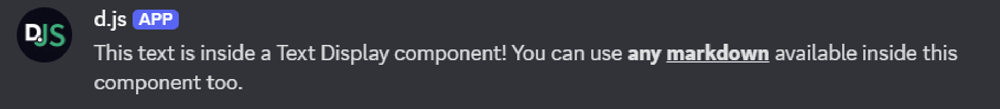
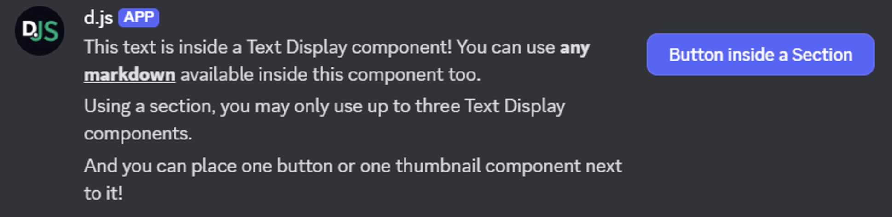
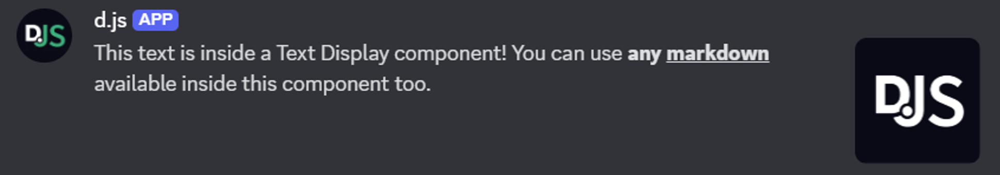
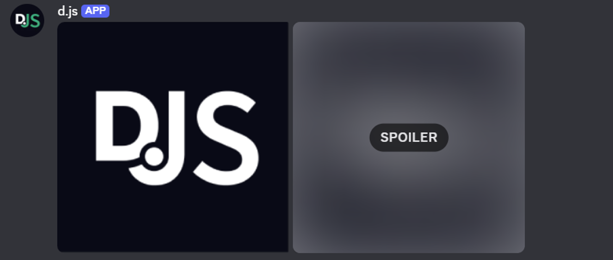
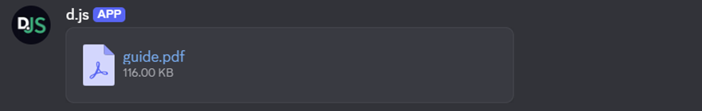
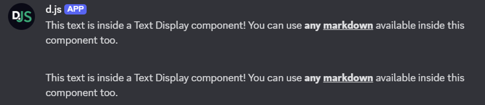
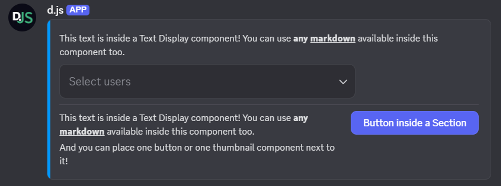

# Components V2

While you might be familiar with [embeds](/popular-topics/embeds.md) in Discord, there are more ways to style and format your messages using **Components V2 (CV2)**, a comprehensive set of layout and content components.

To use the CV2 components, you need to pass in the `IsComponentsV2` message flag from the <DocsLink path="MessageFlags:Enum" /> enum when sending a message. The flag should only be added to the message's `flags` field when the message contains CV2 components, unlike the `Ephemeral` message flag that can be added when you defer an interaction response.

::: warning
Once a message is sent or edited with the `IsComponentsV2` message flag, the flag **cannot** be removed from that message.
:::

All components have an `id` field (which should not be confused with the `custom_id` field for interactive components), which is an optional 32-bit integer identifier for a component presented in a message. It is used to identify non-interactive components in the response from an interaction. More information about these can be found [here](https://discord.com/developers/docs/components/reference#anatomy-of-a-component).

In the following section, we will explain all CV2 components in detail, how they work together with interactive components, and the limitations Discord has set when using CV2 components in your message.

## New components

CV2 brought both layout and content components. While some of the content components resemble existing message elements, they behave slightly different when used as CV2 components.

### Text Display

A Text Display is a content component for adding markdown-formatted text to your message. This component is very similar to the `content` field of a message, but by using multiple Text Display components, you gain greater control over the layout of your message. You can use the <DocsLink path="TextDisplayBuilder:Class" /> class to easily create a Text Display component.

::: tip
In addition to the available markdown in Text Display components, you can also mention users and roles. In components, mentioned users and roles _will_ receive notifications, unlike when adding mentions to embeds. You can add the `allowedMentions` field to your message payload to control who will be notified.
:::

The example below shows how you can send a Text Display component in a channel.

```js
const { TextDisplayBuilder, MessageFlags } = require('discord.js');

const exampleTextDisplay = new TextDisplayBuilder()
	.setContent('This text is inside a Text Display component! You can use **any __markdown__** available inside this component too.');

await channel.send({
	components: [exampleTextDisplay],
	flags: MessageFlags.IsComponentsV2,
});
```



### Section

A Section is a layout component that places between one and three left-aligned Text Display components next to a right-aligned accessory (Thumbnail or Button component). At least one Text Display and the accessory are required. You can use the <DocsLink path="SectionBuilder:Class" /> class to easily create a Section component.

The example below shows how you can send a Section component in a channel containing three Text Display components with a Button component on the right, next to the text.

```js
const { SectionBuilder, ButtonStyle, MessageFlags } = require('discord.js');

const exampleSection = new SectionBuilder()
	.addTextDisplayComponents(
		textDisplay => textDisplay
			.setContent('This text is inside a Text Display component! You can use **any __markdown__** available inside this component too.'),
		textDisplay => textDisplay
			.setContent('Using a section, you may only use up to three Text Display components.'),
		textDisplay => textDisplay
			.setContent('And you can place one button or one thumbnail component next to it!'),
	)
	.setButtonAccessory(
		button => button
			.setCustomId('exampleButton')
			.setLabel('Button inside a Section')
			.setStyle(ButtonStyle.Primary),
	);

await channel.send({
	components: [exampleSection],
	flags: MessageFlags.IsComponentsV2,
});
```



### Thumbnail

A Thumbnail is a content component that is visually similar to the `thumbnail` field inside an embed. Thumbnails are added an accessory inside a [Section](/popular-topics/components-v2.md#section) component, support alt text for accessibility, and can be marked as a spoiler. You can use the <DocsLink path="ThumbnailBuilder:Class" /> class to easily create a Thumbnail component.

The example below shows how you can send a Thumbnail component as a Section component accessory in a channel.

```js
const { AttachmentBuilder, SectionBuilder, MessageFlags } = require('discord.js');

const file = new AttachmentBuilder('../assets/image.png');

const exampleSection = new SectionBuilder()
	.addTextDisplayComponents(
		textDisplay => textDisplay
			.setContent('This text is inside a Text Display component! You can use **any __markdown__** available inside this component too.'),
	)
	.setThumbnailAccessory(
		thumbnail => thumbnail
			.setDescription('alt text displaying on the image')
			.setURL('attachment://image.png'), // Supports arbitrary URLs such as 'https://i.imgur.com/AfFp7pu.png' as well.
	);

await channel.send({
	components: [exampleSection],
	files: [file],
	flags: MessageFlags.IsComponentsV2,
});
```



For more information how to set up custom attachments to use in your Thumbnail component URL, you can look at the guide for [attaching images in embeds](/popular-topics/embeds.md#attaching-images).

### Media Gallery

A Media Gallery is a content component that can display up to 10 media attachments formatted in a structured gallery. Each attachment in the Media Gallery component can have an optional alt text (description) and can be marked as a spoiler. You can use the <DocsLink path="MediaGalleryBuilder:Class" /> and <DocsLink path="MediaGalleryItemBuilder:Class" /> classes to easily create a Media Gallery component and its items.

The example below shows how you can send a Media Gallery component in a channel.

```js
const { AttachmentBuilder, MediaGalleryBuilder, MessageFlags } = require('discord.js');

const file = new AttachmentBuilder('../assets/image.png');

const exampleGallery = new MediaGalleryBuilder()
	.addItems(
		mediaGalleryItem => mediaGalleryItem
			.setDescription('alt text displaying on an image from the AttachmentBuilder')
			.setURL('attachment://image.png'),
		mediaGalleryItem => mediaGalleryItem
			.setDescription('alt text displaying on an image from an external URL')
			.setURL('https://i.imgur.com/AfFp7pu.png')
			.setSpoiler(true), // Will display as a blurred image
	);

await channel.send({
	components: [exampleGallery],
	files: [file],
	flags: MessageFlags.IsComponentsV2,
});
```



### File

A File is a content component that can display a single uploaded file attachment within the body of the message. By using multiple File components, you can upload and display multiple files in a single message. File components cannot have alt text (description), unlike a Thumbnail or Media Gallery component, but can be marked as a spoiler. You can use the <DocsLink path="FileBuilder:Class" /> class to easily create a File component.

The example below shows how you can send a File component in a channel.

```js
const { AttachmentBuilder, FileBuilder, MessageFlags } = require('discord.js');

const file = new AttachmentBuilder('../assets/guide.pdf');

const exampleFile = new FileBuilder()
	.setURL('attachment://guide.pdf');

await channel.send({
	components: [exampleFile],
	files: [file],
	flags: MessageFlags.IsComponentsV2,
});
```



### Separator

A Separator is a layout component that adds vertical padding and optional visual division between components. You can select the amount of padding used for the Separator component (small or large) as well as whether a visual divider should be displayed (defaults to `true`). You can use the <DocsLink path="SeparatorBuilder:Class" /> class to easily create a Separator component.

::: warning
When a Separator component is used without any non-Separator components in the message payload, the message will not have any visible content.
:::

The example below shows how you can send a Separator component in a channel, separating two Text Display components.

```js
const { TextDisplayBuilder, SeparatorBuilder, SeparatorSpacingSize, MessageFlags } = require('discord.js');

const exampleTextDisplay = new TextDisplayBuilder()
	.setContent('This text is inside a Text Display component! You can use **any __markdown__** available inside this component too.');

const exampleSeparator = new SeparatorBuilder()
	.setDivider(false) // No line displayed
	.setSpacing(SeparatorSpacingSize.Large);

await channel.send({
	components: [exampleTextDisplay, exampleSeparator, exampleTextDisplay],
	flags: MessageFlags.IsComponentsV2,
});
```



### Container

A Container is a layout component which groups its child components inside a visually distinct rounded box with an optional accent color on the left, just like embeds. However, unlike embeds, not specifying a color will make the left side of the Container component match the background color. You can also mark the Container component as a spoiler, which blurs all content inside the container. You can use the <DocsLink path="ContainerBuilder:Class" /> class to easily create a Container component.

The example below shows how to send a Container component in a channel. It contains:
- a Text Display component;
- an Action Row component with a User Select component;
- a Separator component;
- a Section component with two Text Display components and a Button component accessory.

```js
const { ContainerBuilder, UserSelectMenuBuilder, ButtonStyle, MessageFlags } = require('discord.js');

const exampleContainer = new ContainerBuilder()
	.setAccentColor(0x0099FF)
	.addTextDisplayComponents(
		textDisplay => textDisplay
			.setContent('This text is inside a Text Display component! You can use **any __markdown__** available inside this component too.'),
	)
	.addActionRowComponents(
		actionRow => actionRow
			.setComponents(
				new UserSelectMenuBuilder()
					.setCustomId('exampleSelect')
					.setPlaceholder('Select users'),
			),
	)
	.addSeparatorComponents(
		separator => separator,
	)
	.addSectionComponents(
		section => section
			.addTextDisplayComponents(
				textDisplay => textDisplay
					.setContent('This text is inside a Text Display component! You can use **any __markdown__** available inside this component too.'),
				textDisplay => textDisplay
					.setContent('And you can place one button or one thumbnail component next to it!'),
			)
			.setButtonAccessory(
				button => button
					.setCustomId('exampleButton')
					.setLabel('Button inside a Section')
					.setStyle(ButtonStyle.Primary),
			),
	);

await channel.send({
	components: [exampleContainer],
	flags: MessageFlags.IsComponentsV2,
});
```



## Limitations

There are a few limits set by the Discord API to be aware of when using Components V2 in your messages. These limits are:

- To use any of the components listed under [New components](/popular-topics/components-v2.md#new-components) you must set the `IsComponentsV2` message flag in your message payload.
- Setting the `IsComponentsV2` message flag will disable the `content` and `embeds` fields. You can use [Text Display](/popular-topics/components-v2.md#text-display) and [Container](/popular-topics/components-v2.md#container) components as replacements.
- Setting the `IsComponentsV2` message flag will disable the `poll` and `stickers` fields, and there are no CV2 replacements for these fields you can use.
- When upgrading a message to a CV2 flagged message by editing the message with the `IsComponentsV2` flag, all mentioned fields in the message object (`content`, `embeds`, `poll` and `stickers`) need to be set to `null`.
- Attachments won't show by default, they must be set through the available media components ([Thumbnail](/popular-topics/components-v2.md#thumbnail), [Media Gallery](/popular-topics/components-v2.md#media-gallery) and [File](/popular-topics/components-v2.md#file)).
- Messages allow up to 40 total components.
