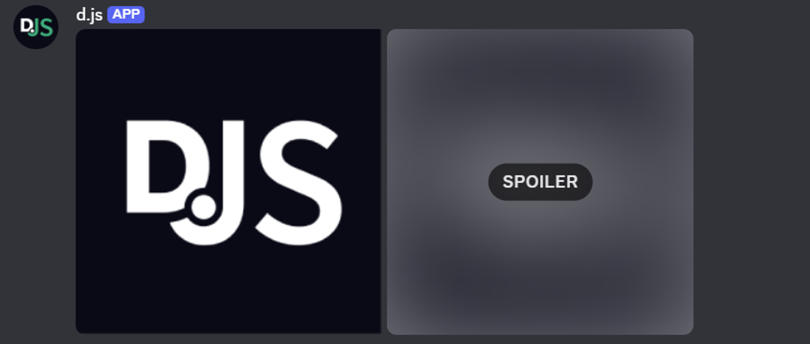
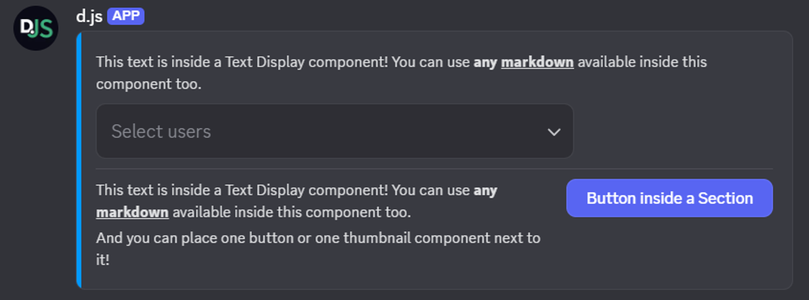

# Display Components 

While you might be familiar with [embeds](/popular-topics/embeds.md) in Discord, there are more ways to style and format your apps messages using **display components**, a comprehensive set of layout and content elements.

To use the display components, you need to pass the `IsComponentsV2` message flag (<DocsLink path="MessageFlags:Enum" />) when sending a message. You only need to use this flag when sending a message using the display components system, not when deffering interaction responses.

::: warning
Opting into using this system by passing the `IsComponentsV2` comes with a set of caveats:
- You **cannot** send `content`, `poll`, `embeds`, or `stickers`.
- You **cannot** opt out of using display components when editing a message
- You **can** opt into using display components when editing a message while explicitly setting `content`, `poll`, `embeds`, and `stickers` to null.
- Messages can have up to **40** total components (nested components count!)
- The amount of text across all text display components **cannot** exceed 4000 characters.
- All attached files have to explicitly be referenced in a component (refer to the [Thumbnail](/popular-topics/display-components#thumbnail), [Media Gallery](/popular-topics/display-components#media-gallery), and [File](/popular-topics/display-components#file) sections).
:::


All components can be passed an optional `id` field holding a 32-bit integer identifier to later identify them in interaction responses. Do not confuse this with the `custom_id` field for interactive components! You can find more information about this field [on the discord API documentation](https://discord.com/developers/docs/components/reference#anatomy-of-a-component).


In the following section, we will explain all display components in detail, how they work together with interactive components, and their limitations. 

## Text Display

Text Display components let you add markdown-formatted text to your message and directly replace the `content` field when opting to use display components. You can use the <DocsLink path="TextDisplayBuilder:Class" /> class to easily create a Text Display component.

::: danger
Sending user and role mentions in text display components **will notify users and roles**! You can and should control mentions with the `allowedMentions` message option.
:::

The example below shows how you can send a Text Display component in a channel.

```js
const { TextDisplayBuilder, MessageFlags } = require('discord.js');

const exampleTextDisplay = new TextDisplayBuilder()
	.setContent('This text is inside a Text Display component! You can use **any __markdown__** available inside this component too.');

await channel.send({
	components: [exampleTextDisplay],
	flags: MessageFlags.IsComponentsV2,
});
```


## Section

Sections represent text (one to three Text Display components) with an accessory. The accessory can either be an image (thumbnail) or button. If you do not want to send an accessory, use a [Text Display](/popular-topics/display-components.md#text-display) component instead. You can use the <DocsLink path="SectionBuilder:Class" /> class to easily create a Section component:

```js
const { SectionBuilder, ButtonStyle, MessageFlags } = require('discord.js');

const exampleSection = new SectionBuilder()
	.addTextDisplayComponents(
		textDisplay => textDisplay
			.setContent('This text is inside a Text Display component! You can use **any __markdown__** available inside this component too.'),
		textDisplay => textDisplay
			.setContent('Using a section, you may only use up to three Text Display components.'),
		textDisplay => textDisplay
			.setContent('And you can place one button or one thumbnail component next to it!'),
	)
	.setButtonAccessory(
		button => button
			.setCustomId('exampleButton')
			.setLabel('Button inside a Section')
			.setStyle(ButtonStyle.Primary),
	);

await channel.send({
	components: [exampleSection],
	flags: MessageFlags.IsComponentsV2,
});
```


## Thumbnail

A Thumbnail is a display component that is visually similar to the `thumbnail` field inside an embed. Thumbnails are added as accessory inside a [Section](/popular-topics/display-components.md#section) component, support alt text for accessibility, and can be marked as a spoiler. You can use the <DocsLink path="ThumbnailBuilder:Class" /> class to easily create a Thumbnail component:

```js
const { AttachmentBuilder, SectionBuilder, MessageFlags } = require('discord.js');

const file = new AttachmentBuilder('../assets/image.png');

const exampleSection = new SectionBuilder()
	.addTextDisplayComponents(
		textDisplay => textDisplay
			.setContent('This text is inside a Text Display component! You can use **any __markdown__** available inside this component too.'),
	)
	.setThumbnailAccessory(
		thumbnail => thumbnail
			.setDescription('alt text displaying on the image')
			.setURL('attachment://image.png'), // Supports arbitrary URLs such as 'https://i.imgur.com/AfFp7pu.png' as well.
	);

await channel.send({
	components: [exampleSection],
	files: [file],
	flags: MessageFlags.IsComponentsV2,
});
```


For more information about using attachments in components refer to the guide on [attaching images in embeds](/popular-topics/embeds.md#attaching-images).

## Media Gallery

A Media Gallery is a display component that can display a grid of up to 10 media attachments. Each media item can have an optional alt text (description) and can be marked as spoiler. You can use the <DocsLink path="MediaGalleryBuilder:Class" /> and <DocsLink path="MediaGalleryItemBuilder:Class" /> classes to easily create a Media Gallery component and its items:

```js
const { AttachmentBuilder, MediaGalleryBuilder, MessageFlags } = require('discord.js');

const file = new AttachmentBuilder('../assets/image.png');

const exampleGallery = new MediaGalleryBuilder()
	.addItems(
		mediaGalleryItem => mediaGalleryItem
			.setDescription('alt text displaying on an image from the AttachmentBuilder')
			.setURL('attachment://image.png'),
		mediaGalleryItem => mediaGalleryItem
			.setDescription('alt text displaying on an image from an external URL')
			.setURL('https://i.imgur.com/AfFp7pu.png')
			.setSpoiler(true), // Will display as a blurred image
	);

await channel.send({
	components: [exampleGallery],
	files: [file],
	flags: MessageFlags.IsComponentsV2,
});
```



## File

A File is a display component that can display a single uploaded file within the body of the message. By using multiple File components, you can upload and display multiple files in a single message. File components cannot have alt texts (description), unlike a Thumbnail or Media Gallery component, but can be marked as a spoiler. You can use the <DocsLink path="FileBuilder:Class" /> class to easily create a File component:

```js
const { AttachmentBuilder, FileBuilder, MessageFlags } = require('discord.js');

const file = new AttachmentBuilder('../assets/guide.pdf');

const exampleFile = new FileBuilder()
	.setURL('attachment://guide.pdf');

await channel.send({
	components: [exampleFile],
	files: [file],
	flags: MessageFlags.IsComponentsV2,
});
```


## Separator

A Separator is a layout component that adds vertical padding and optional visual division between components. You can select the amount of padding used for the Separator component (small or large) as well as whether a visual divider should be displayed (defaults to `true`). You can use the <DocsLink path="SeparatorBuilder:Class" /> class to easily create a Separator component.

::: warning
When a Separator component is used without any non-Separator components in the message payload, the message will not have any visible content.
:::

The example below shows how you can send a Separator component in a channel, separating two Text Display components.

```js
const { TextDisplayBuilder, SeparatorBuilder, SeparatorSpacingSize, MessageFlags } = require('discord.js');

const exampleTextDisplay = new TextDisplayBuilder()
	.setContent('This text is inside a Text Display component! You can use **any __markdown__** available inside this component too.');

const exampleSeparator = new SeparatorBuilder()
	.setDivider(false) // No line displayed
	.setSpacing(SeparatorSpacingSize.Large);

await channel.send({
	components: [exampleTextDisplay, exampleSeparator, exampleTextDisplay],
	flags: MessageFlags.IsComponentsV2,
});
```


## Container

A Container is a layout component which groups its child components inside a visually distinct rounded box with an optional accent color on the left, similar to the message embed look. Unlike embeds, not specifying a color will make the left side of the Container component match the background color. You can mark Container components as spoiler, which blurs all content inside the container. You can use the <DocsLink path="ContainerBuilder:Class" /> class to easily create a Container component.

The example below shows how to send a Container component in a channel. It contains:
- a Text Display component;
- an Action Row component with a User Select component;
- a Separator component;
- a Section component with two Text Display components and a Button component accessory.

```js
const { ContainerBuilder, UserSelectMenuBuilder, ButtonStyle, MessageFlags } = require('discord.js');

const exampleContainer = new ContainerBuilder()
	.setAccentColor(0x0099FF)
	.addTextDisplayComponents(
		textDisplay => textDisplay
			.setContent('This text is inside a Text Display component! You can use **any __markdown__** available inside this component too.'),
	)
	.addActionRowComponents(
		actionRow => actionRow
			.setComponents(
				new UserSelectMenuBuilder()
					.setCustomId('exampleSelect')
					.setPlaceholder('Select users'),
			),
	)
	.addSeparatorComponents(
		separator => separator,
	)
	.addSectionComponents(
		section => section
			.addTextDisplayComponents(
				textDisplay => textDisplay
					.setContent('This text is inside a Text Display component! You can use **any __markdown__** available inside this component too.'),
				textDisplay => textDisplay
					.setContent('And you can place one button or one thumbnail component next to it!'),
			)
			.setButtonAccessory(
				button => button
					.setCustomId('exampleButton')
					.setLabel('Button inside a Section')
					.setStyle(ButtonStyle.Primary),
			),
	);

await channel.send({
	components: [exampleContainer],
	flags: MessageFlags.IsComponentsV2,
});
```



