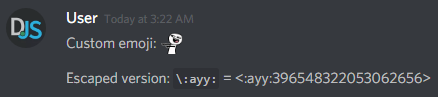

# Reactions

## Reacting to messages

One of the first things many people want to know is how to react with emojis, both custom and "regular" (Unicode). There are different routes you need to take for each of those, so let's look at both.

Here's the base code we'll be using:

```js
const Discord = require('discord.js');
const client = new Discord.Client();

client.once('ready', () => {
	console.log('Ready!');
});

client.on('message', message => {
	// ...
});

client.login('your-token-goes-here');
```

### Unicode emojis

To react with a Unicode emoji, you will need the actual Unicode character of the emoji. There are many ways to get a Unicode character of an emoji, but the easiest way would be through Discord itself. If you send a message with a Unicode emoji (such as `:smile:`, for example) and put a `\` before it, it will "escape" the emoji and display the Unicode character instead of the standard emoji image.


To react with an emoji, you need to use the `message.react()` method. Once you have the emoji character, all you need to do is copy & paste it as a string inside the `.react()` method!

```js {2-4}
client.on('message', message => {
	if (message.content === '!react') {
		message.react('😄');
	}
});
```


### Custom emojis

For custom emojis, there are multiple ways of reacting. Like Unicode emojis, you can also escape custom emojis. However, when you escape a custom emoji, the result will be different.



This format is essentially the name of the emoji, followed by its ID. Copy & paste the ID into the `.react()` method as a string.

```js {2-4}
client.on('message', message => {
	if (message.content === '!react-custom') {
		message.react('396548322053062656');
	}
});
```


Great! This route may not always be available to you, though. Sometimes you'll need to react with an emoji programmatically. To do so, you'll need to retrieve the emoji object.

Two of the easiest ways you can retrieve an emoji would be:

* Use `.find()` on a Collection of Emojis.
* Use `.get()` on the <branch version="11.x" inline>`client.emojis`</branch><branch version="12.x" inline>`client.emojis.cache`</branch> Collection.

::: tip
Two or more emojis can have the same name, and using `.find()` will only return the **first** entry it finds. As such, this can cause unexpected results.
:::

Using `.find()`, your code would look something like this:

<branch version="11.x">

```js {2-3}
if (message.content === '!react-custom') {
	const reactionEmoji = message.guild.emojis.find(emoji => emoji.name === 'ayy');
	message.react(reactionEmoji);
}
```

</branch>
<branch version="12.x">

```js {2-3}
if (message.content === '!react-custom') {
	const reactionEmoji = message.guild.emojis.cache.find(emoji => emoji.name === 'ayy');
	message.react(reactionEmoji);
}
```

</branch>

Using `.get()`, your code would look something like this:

<branch version="11.x">

```js {2-3}
if (message.content === '!react-custom') {
	const reactionEmoji = client.emojis.get(config.emojiID);
	message.react(reactionEmoji);
}
```

</branch>
<branch version="12.x">

```js {2-3}
if (message.content === '!react-custom') {
	const reactionEmoji = client.emojis.cache.get(config.emojiID);
	message.react(reactionEmoji);
}
```

</branch>

Of course, if you already have the emoji ID, you should put that directly inside the `.react()` method. But if you want to do other things with the emoji data later on (e.g., display the name or image URL), it's best to retrieve the full emoji object.

### Reacting in order

If you just put one `message.react()` under another, it won't always react in order as-is. This is because `.react()` is a Promise and an asynchronous operation.

```js {2-6}
client.on('message', message => {
	if (message.content === '!fruits') {
		message.react('🍎');
		message.react('🍊');
		message.react('🍇');
	}
});

```


As you can see, if you leave it like that, it won't display as you want. It was able to react correctly on the first try but reacts differently each time after that.

Luckily, there are two easy solutions to this. The first would be to chain `.then()`s in the order you want it to display.

```js {3-6}
client.on('message', message => {
	if (message.content === '!fruits') {
		message.react('🍎')
			.then(() => message.react('🍊'))
			.then(() => message.react('🍇'))
			.catch(error => console.error('One of the emojis failed to react:', error));
	}
});
```

The other would be to use the `async`/`await` keywords.

```js {1,3-9}
client.on('message', async message => {
	if (message.content === '!fruits') {
		try {
			await message.react('🍎');
			await message.react('🍊');
			await message.react('🍇');
		} catch (error) {
			console.error('One of the emojis failed to react:', error);
		}
	}
});
```

If you try again with either of the code blocks above, you'll get the result you originally wanted!


::: tip
If you aren't familiar with Promises or `async`/`await`, you can read more about them on [MDN](https://developer.mozilla.org/en-US/docs/Web/JavaScript/Reference/Global_Objects/Promise) or [our guide page on async/await](/additional-info/async-await.md)!
:::

### Handling multiple reactions if the order doesn't matter

However, if you don't mind the order the emojis react in, you can take advantage of `Promise.all()`, like so:

```js {2-7}
if (message.content === '!fruits') {
	Promise.all([
		message.react('🍎'),
		message.react('🍊'),
		message.react('🍇'),
	])
		.catch(error => console.error('One of the emojis failed to react:', error));
}
```

This small optimization allows you to use `.then()` to handle when all of the Promises have resolved, or `.catch()` when one fails. You can also `await` it since it returns a Promise itself.

## Removing reactions

Now that you know how to add reactions, you might be asking, how do you remove them? In this section, you will learn how to remove all reactions, remove reactions by user, and remove reactions by emoji.

::: warning
All of these methods require `MANAGE_MESSAGES` permissions. Ensure your bot has permissions before attempting to utilize any of these methods, as it will error if it doesn't.
:::

### Removing all reactions

Removing all reactions from a message is the easiest, the API allows you to do this through a single call. It can be done through the <branch version="11.x" inline>`message.clearReactions()`</branch><branch version="12.x" inline>`message.reactions.removeAll()`</branch> method. 

<branch version="11.x">

```js
message.clearReactions().catch(error => console.error('Failed to clear reactions: ', error));
```

</branch>
<branch version="12.x">

```js
message.reactions.removeAll().catch(error => console.error('Failed to clear reactions: ', error));
```

</branch>

### Removing reactions by emoji

<branch version="11.x">

Removing reactions by emoji is not as straightforward as clearing all reactions. discord.js version 11.x does not provide a method for selectively removing reactions by emoji; it only allows you to remove a user from a specific reaction. This means you will have to get the users who reacted with that emoji and loop through to remove each one of them.

Reaction collections are keyed by `name:id` for custom emojis and by `name` for Unicode emojis (represented by their Unicode character, see [here](/popular-topics/reactions.html#unicode-emojis)). Once you have the key, you can run a `.get()` on `message.reactions` to get the reaction representing the emoji you want.

<!-- eslint-skip -->
```js
const reaction = message.reactions.get('Thonk:484535447171760141');
try {
	for (const user of reaction.users.values()) {
		await reaction.remove(user);
	}
} catch (error) {
	console.error('Failed to remove reactions.');
}
```

The reason we use a `for...of` loop over something like `.forEach()` is due to `.forEach()`'s behavior for async operations. `.forEach()` will send out all calls almost at once even if you await inside of the function. However, if you `await` inside of a `for...of` loop, it will wait for the previous reaction to go through, and you avoid spamming the API with a lot of calls at once.

</branch>
<branch version="12.x">

Removing reactions by emoji is easily done by using <docs-link path="class/MessageReaction?scrollTo=remove">`MessageReaction.remove()`</docs-link>.

```js
message.reactions.cache.get('484535447171760141').remove().catch(error => console.error('Failed to remove reactions: ', error));
```

</branch>

### Removing reactions by user
::: tip
If you are not familiar with <branch version="11.x" inline><docs-link path="class/Collection?scrollTo=filter">`Collection.filter()`</docs-link></branch><branch version="12.x" inline><docs-link section="collection" path="class/Collection?scrollTo=filter">`Collection.filter()`</docs-link></branch> and [`Map.has()`](https://developer.mozilla.org/en-US/docs/Web/JavaScript/Reference/Global_Objects/Map/has) take the time to understand what they do and then come back.
:::

<branch version="11.x">

Removing reactions by user is similar to what you did before. However, instead of iterating through users of a reaction, you will iterate through reactions that include a user. To do this, you will get all reactions and filter based on whether the user has reacted. 

<!-- eslint-skip -->
```js
const userReactions = message.reactions.filter(reaction => reaction.users.has(userId));
try {
	for (const reaction of userReactions.values()) {
		await reaction.remove(userId);
	}
} catch (error) {
	console.error('Failed to remove reactions.');
}
```

::: warning
Make sure not to remove reactions by emoji or by user too much; if there are many reactions or users, it can be considered API spam.
:::

</branch>
<branch version="12.x">

Removing reactions by a user is not as straightforward as removing by emoji or removing all reactions. The API does not provide a method for selectively removing the reactions of a user. This means you will have to iterate through reactions that include the user and remove them.

<!-- eslint-skip -->
```js
const userReactions = message.reactions.cache.filter(reaction => reaction.users.cache.has(userId));
try {
	for (const reaction of userReactions.values()) {
		await reaction.users.remove(userId);
	}
} catch (error) {
	console.error('Failed to remove reactions.');
}
```

::: warning
Make sure not to remove reactions by emoji or by user too much; if there are many reactions or users, it can be considered API spam.
:::

</branch>

## Awaiting reactions

A common use case for reactions in commands is having a user confirm or deny an action or creating a poll system. Luckily, we actually [already have a guide page covering this](/popular-topics/collectors.md)! Check out that page if you want a more in-depth explanation. Otherwise, here's a basic example for reference:

```js
message.react('👍').then(() => message.react('👎'));

const filter = (reaction, user) => {
	return ['👍', '👎'].includes(reaction.emoji.name) && user.id === message.author.id;
};

message.awaitReactions(filter, { max: 1, time: 60000, errors: ['time'] })
	.then(collected => {
		const reaction = collected.first();

		if (reaction.emoji.name === '👍') {
			message.reply('you reacted with a thumbs up.');
		} else {
			message.reply('you reacted with a thumbs down.');
		}
	})
	.catch(collected => {
		message.reply('you reacted with neither a thumbs up, nor a thumbs down.');
	});
```

## Listening for reactions on old messages

<branch version="11.x">

discord.js v11 cannot emit events if the respective structures it needs to emit are incomplete and does not auto-fetch the missing information.
This behavior changed in version 12 of the library. It introduces partial structures that enable you to emit incomplete structures and complete them with a single fetch call.
This feature is not available on version 11.x if you want to listen for reactions on old messages, please use version 12 of the library.

</branch>
<branch version="12.x">

Messages sent before your bot started are uncached unless you fetch them first. By default, the library does not emit client events if the data received and cached is not sufficient to build fully functional objects.
Since version 12, you can change this behavior by activating partials. For a full explanation of partials see [this page](/popular-topics/partials.md).

Make sure you enable partial structures for `MESSAGE`, `CHANNEL`, and `REACTION` when instantiating your client if you want reaction events on uncached messages for both server and direct message channels. If you do not want to support direct message channels, you can exclude `CHANNEL`.

::: tip
If you use [gateway intents](/popular-topics/intents.md) but can't or don't want to use the privileged `GUILD_PRESENCES` intent, you additionally need the `USER` partial.
:::

```js
const Discord = require('discord.js');
const client = new Discord.Client({ partials: ['MESSAGE', 'CHANNEL', 'REACTION'] });
client.on('messageReactionAdd', async (reaction, user) => {
	// When a reaction is received, check if the structure is partial
	if (reaction.partial) {
		// If the message this reaction belongs to was removed, the fetching might result in an API error which should be handled
		try {
			await reaction.fetch();
		} catch (error) {
			console.error('Something went wrong when fetching the message: ', error);
			// Return as `reaction.message.author` may be undefined/null
			return;
		}
	}
	// Now the message has been cached and is fully available
	console.log(`${reaction.message.author}'s message "${reaction.message.content}" gained a reaction!`);
	// The reaction is now also fully available and the properties will be reflected accurately:
	console.log(`${reaction.count} user(s) have given the same reaction to this message!`);
});
```

::: warning
Partial structures are enabled globally. You cannot only make them work for a specific event or cache, and you very likely need to adapt other parts of your code that are accessing data from the relevant caches. All caches holding the respective structure type might return partials as well!
:::

</branch>

## Resulting code

<resulting-code />
