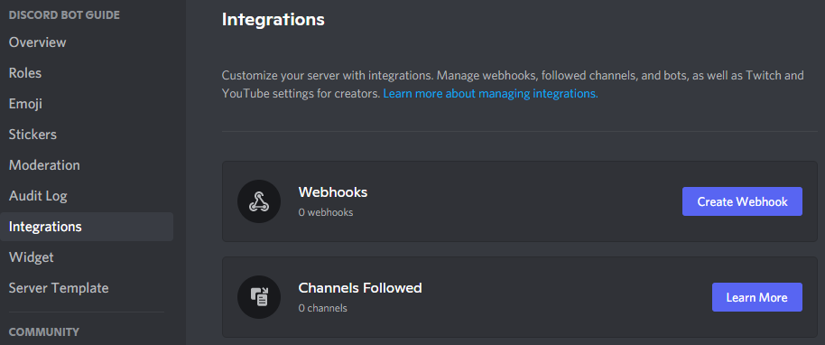
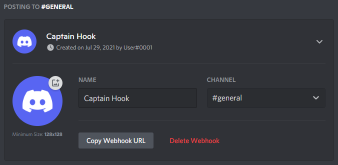

# Webhooks

Webhooks can send messages to a text channel without having to log in as a bot. discord.js implements a variety of methods to fetch, create, edit, and use webhooks. In this section, you will learn how to create, fetch, edit, and use webhooks.

## What is a webhook

Webhooks are a utility used to send messages to text channels without needing a Discord application. Webhooks are useful for allowing something to send messages without requiring a Discord application. However, you should note that you cannot directly edit or delete messages you sent through the webhook. discord.js introduces two structures to make use of this functionality, `Webhook` and `WebhookClient`. `WebhookClient` is an extended version of a `Webhook` which allows you to send messages through it without needing a bot client.

::: tip
If you would like to read about using webhooks through the API without discord.js, you can read about them [here](https://discord.com/developers/docs/resources/webhook).
:::

## Detecting webhook messages

Bots receive webhook messages in a text channel as usual. You can detect if a webhook sent the message by checking if the `Message.webhookID` is not `null`. In this example, we return if a webhook sent the message.

<!-- eslint-skip -->
```js
if (message.webhookID) return;
```

If you would like to get the webhook object that sent the message, you can use <docs-link path="class/Message?scrollTo=fetchWebhook">`Message#fetchWebhook`</docs-link>.

## Fetching webhooks

::: tip
Webhook fetching will always make use of collections and Promises. If you do not understand either concept, revise them, and then come back to this section.  You can read about collections [here](/additional-info/collections.md), and Promises [here](/additional-info/async-await.md) and [here](https://developer.mozilla.org/en-US/docs/Web/JavaScript/Guide/Using_promises).
:::

### Fetching all webhooks of a guild

If you would like to get all webhooks of a guild you can use <docs-link path="class/Guild?scrollTo=fetchWebhooks">`Guild#fetchWebhooks()`</docs-link>. This will return a Promise which will resolve into a Collection of `Webhook`s.

### Fetching webhooks of a channel

Webhooks belonging to a channel can be fetched using <docs-link path="class/TextChannel?scrollTo=fetchWebhooks">`TextChannel#fetchWebhooks()`</docs-link>. This will return a Promise which will resolve into a Collection of `Webhook`s. A collection will be returned even if the channel contains a single webhook. If you are certain the channel contains a single webhook, you can use <branch version="11.x" inline><docs-link path="class/Collection?scrollTo=first">`Collection#first()`</docs-link></branch><branch version="12.x" inline><docs-link section="collection" path="class/Collection?scrollTo=first">`Collection#first()`</docs-link></branch> on the Collection to get the webhook.

### Fetching a single webhook

#### Using client

You can fetch a specific webhook using its `id` with <docs-link path="class/Client?scrollTo=fetchWebhook">`Client#fetchWebhook()`</docs-link>. You can obtain the webhook id by looking at its link, the number after `https://discord.com/api/webhooks/` is the `id`, and the part after that is the `token`.

#### Using the WebhookClient constructor

If you are not using a bot client, you can get a webhook by creating a new instance of `WebhookClient` and passing the `id` and `token` into the constructor. These credentials do not require you to have a bot application, but it also offers limited information instead of fetching it using an authorized client.

```js
const webhookClient = new Discord.WebhookClient('id', 'token');
```

## Creating webhooks

### Creating webhooks through server settings

You can create webhooks directly through the Discord client. Go to Server Settings, and you will see an `Integrations` tab.



If you already have created a webhook, the webhooks tab will look like this; you will need to click the `View Webhooks` button.


Once you are there, click on the `Create Webhook` / `New Webhook` button; this will create a webhook. From here, you can edit the channel, the name, and the avatar. Copy the link, the first part is the id, and the second is the token.



### Creating webhooks with discord.js


discord.js provides a method for creating webhooks called <docs-link path="class/TextChannel?scrollTo=createWebhook">`TextChannel#createWebhook()`</docs-link>.

<branch version="11.x">

```js
channel.createWebhook('Some-username', 'https://i.imgur.com/wSTFkRM.png')
	.then(webhook => console.log(`Created webhook ${webhook}`))
	.catch(console.error);
```

</branch>
<branch version="12.x">

```js
channel.createWebhook('Some-username', {
	avatar: 'https://i.imgur.com/wSTFkRM.png',
})
	.then(webhook => console.log(`Created webhook ${webhook}`))
	.catch(console.error);
```

</branch>

## Editing webhooks

You can edit Webhooks and WebhookClients to change their name, avatar, and channel using <docs-link path="class/Webhook?scrollTo=edit">`Webhook#edit()`</docs-link>.

```js
webhook.edit({
	name: 'Some-username',
	avatar: 'https://i.imgur.com/wSTFkRM.png',
	channel: '222197033908436994',
})
	.then(webhook => console.log(`Edited webhook ${webhook}`))
	.catch(console.error);
```

## Using webhooks

Webhooks, unlike bots, can send more than one embed per message, up to 10. They can also send attachments and normal content. The <docs-link path="class/Webhook?scrollTo=send">`Webhook#send()`</docs-link> method to send to a webhook is very similar to the method for sending to a text channel. Webhooks can also choose how the username and avatar will appear when they send the message.

<branch version="11.x">

Example using a WebhookClient:

```js
const Discord = require('discord.js');
const config = require('./config.json');

const webhookClient = new Discord.WebhookClient(config.webhookID, config.webhookToken);

const embed = new Discord.RichEmbed()
	.setTitle('Some Title')
	.setColor('#0099ff');

webhookClient.send('Webhook test', {
	username: 'some-username',
	avatarURL: 'https://i.imgur.com/wSTFkRM.png',
	embeds: [embed],
});
```

Example using a Webhook:

```js
const Discord = require('discord.js');
const config = require('./config.json');

const client = new Discord.Client();

const embed = new Discord.RichEmbed()
	.setTitle('Some Title')
	.setColor('#0099ff');

client.once('ready', async () => {
	const channel = client.channels.get('222197033908436994');
	try {
		const webhooks = await channel.fetchWebhooks();
		const webhook = webhooks.first();

		await webhook.send('Webhook test', {
			username: 'some-username',
			avatarURL: 'https://i.imgur.com/wSTFkRM.png',
			embeds: [embed],
		});
	} catch (error) {
		console.error('Error trying to send: ', error);
	}
});

client.login(token);
```

</branch>
<branch version="12.x">

Example using a WebhookClient:

```js
const Discord = require('discord.js');
const config = require('./config.json');

const webhookClient = new Discord.WebhookClient(config.webhookID, config.webhookToken);

const embed = new Discord.MessageEmbed()
	.setTitle('Some Title')
	.setColor('#0099ff');

webhookClient.send('Webhook test', {
	username: 'some-username',
	avatarURL: 'https://i.imgur.com/wSTFkRM.png',
	embeds: [embed],
});
```

Example using a Webhook:

```js
const Discord = require('discord.js');
const config = require('./config.json');

const client = new Discord.Client();

const embed = new Discord.MessageEmbed()
	.setTitle('Some Title')
	.setColor('#0099ff');

client.once('ready', async () => {
	const channel = client.channels.cache.get('222197033908436994');
	try {
		const webhooks = await channel.fetchWebhooks();
		const webhook = webhooks.first();

		await webhook.send('Webhook test', {
			username: 'some-username',
			avatarURL: 'https://i.imgur.com/wSTFkRM.png',
			embeds: [embed],
		});
	} catch (error) {
		console.error('Error trying to send: ', error);
	}
});

client.login(token);
```
</branch>

## Resulting code

<resulting-code/>
