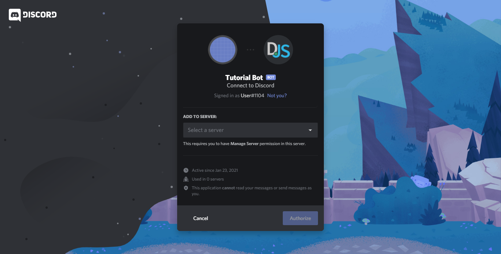
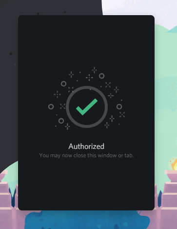
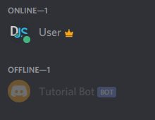

# Adding your bot to servers

If you've been following the guide's previous pages, you should have a bot application set up. However, it's not in any servers yet. So how does that work?

Before you're able to see your bot in your own (or other) servers, you'll need to add it by creating and using a unique invite link using your bot application's client ID.

## Bot invite links

The basic version of one such link looks like this:

```
https://discord.com/api/oauth2/authorize?client_id=123456789012345678&permissions=8&scope=bot%20applications.commands
```

The structure of the url is quite simple:

* The first part is just Discord's standard structure for authorizing an OAuth2 application (such as your bot application) for entry to a Discord server.
* The second part that says `client_id=...` is to specify _which_ application you want to authorize. You'll need to replace this part with your client's ID to create a valid invite link.
* The third part, the one with `permissions=...`, describe what permissions your bot will have on the server you are adding it to.
* Lastly, the fourth part, which says `scope=bot%20applications.commands`, specifies that you want to add this application as a Discord bot, with the ability to create Slash Commands.

::: warning
If you get an error message saying "Bot requires a code grant", then head over into your application's settings and disable the "Require OAuth2 Code Grant" option. You usually shouldn't enable this checkbox unless you know why you need to.
:::

## Creating and using your invite link

To create your invite link you need to go in the `OAuth2` page of your app.

Head back to the [My Apps](https://discord.com/developers/applications/me) page under the "Applications" section once again and click on your bot application, then go in the `OAuth2` section and do the following steps: 

* In lower part of the page you can find a section named "SCOPES", in this section there are a bunch of check boxes, you need to select `bot` and `applications.commands`.
* When you click on the `bot` scope a new section named "BOT PERMISSIONS" will appear, in this new section you can find new check boxes that rappresent the permission your bot will have in the server. Select all the permissions your bot need.
* Then just click the `Copy` button in the "SCOPES" section

::: tip
If you want to grant all permissions to your bot just select `Administrator`.
:::

To use this link just paste it in the browser and hit enter, you shuld see something like this (with your bot's username and avatar):



Choose the server you want to add it to and click "Authorize". Do note that you'll need the "Manage Server" permission on a server to add your bot there. This should then present you a nice confirmation message:



Congratulations! You've successfully added your bot to your Discord server. It should show up in your server's member list somewhat like this:


