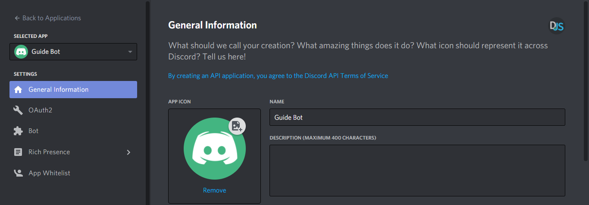
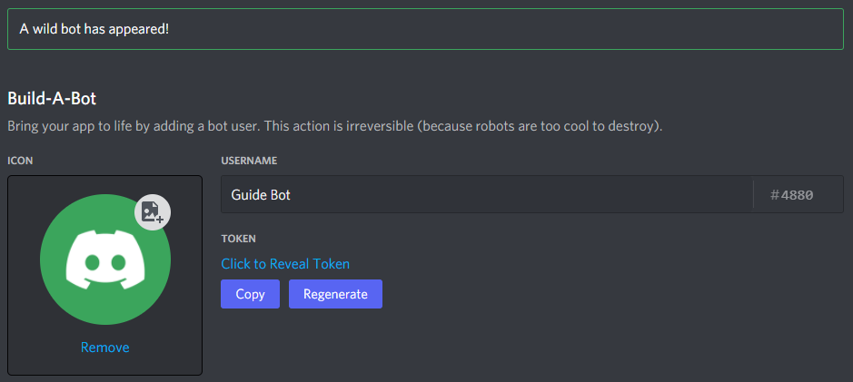

# Setting up a bot application

## Creating your bot

Now that you've installed Node, discord.js, and hopefully a linter, you're almost ready to start coding! The next step you need to take is setting up an actual Discord bot application via Discord's website.

It's effortless to create one. The steps you need to take are as follows:

1. Open [the Discord developer portal](https://discord.com/developers/applications) and log into your account.
2. Click on the "New Application" button.
3. Enter a name and optionally select a team (if you want the bot to belong to one). Then confirm the pop-up window by clicking the "Create" button.

You should see a page like this:



You can optionally enter a name, description, and avatar for your application here. Once you've saved your changes, you can move on by selecting the "Bot" tab in the left pane.


Click the "Add Bot" button on the right and confirm the pop-up window by clicking "Yes, do it!". Congratulations, you're now the proud owner of a shiny new Discord bot! You're not entirely done, though.

## Your token

::: danger
This section is critical, so pay close attention. It explains what your bot token is, as well as the security aspects of it.
:::

After creating a bot user, you'll see a section like this:



In this panel, you can give your bot a snazzy avatar, set its username, and make it public or private. You can access your token in this panel as well, either by revealing it or pressing the "Copy" button. When we ask you to paste your token somewhere, this is the value that you need to put in. Don't worry if you do happen to lose it at some point; you can always come back to this page and copy it again.

### What is a token, anyway?

A token is essentially your bot's password; it's what your bot uses to login to Discord. With that said, **it is vital that you do not ever share this token with anybody, purposely or accidentally**. If someone does manage to get a hold of your token, they can use your bot as if it were theirs—this means they can perform malicious acts with it.

Tokens look like this: `NzkyNzE1NDU0MTk2MDg4ODQy.X-hvzA.Ovy4MCQywSkoMRRclStW4xAYK7I` (don't worry, we immediately reset this token before even posting it here!). If it's any shorter and looks more like this: `kxbsDRU5UfAaiO7ar9GFMHSlmTwYaIYn`, you copied your client secret instead. Make sure to copy the token if you want your bot to work!

### Token leak scenario

Let's imagine that you have a bot on over 1,000 servers, and it took you many, many months of coding and patience to get it on that amount. Your token gets leaked somewhere, and now someone else has it. That person can:

* Spam every server your bot is on;
* Attempt to DM spam as many users as they can;
* Attempt to delete as many channels as they can;
* Attempt to kick or ban as many server members as they possibly can;
* Make your bot leave all of the servers it has joined.
* Access and damage the underlying infrastructure (your server)

All that and much, much more. Sounds pretty terrible, right? So make sure to keep your token as safe as possible!

::: danger
If you ever somehow compromise your current bot token (commit it to a public repository, post it in support, etc.) or otherwise see your bot in danger, return to this page and press "Regenerate" to generate a new token. As you do so, all old tokens will become invalidated. Keep in mind that you will need to update your token where you used it before.
:::

### Keeping your token safe

Now that we explained why your token is essential and why you should prevent giving it to others, let's quickly talk about how you can avoid accidentally leaking it.

#### Environment variables

Environment variables are special values your environment (for example, your console, docker container, or environment variable file) can pass to your code's scope so that you can use them inside.

One way to pass environment variables is via the command line interface you use to start your node process. When starting your app, instead of `node index.js` to begin your process, you can use `TOKEN=NzkyNzE1NDU0MTk2MDg4ODQy.X-hvzA.Ovy4MCQywSkoMRRclStW4xAYK7I node index.js`. You can repeat this pattern to expose other values as well: `TOKEN=NzkyNzE1NDU0MTk2MDg4ODQy.X-hvzA.Ovy4MCQywSkoMRRclStW4xAYK7I A=123 B=456 node index.js`

You can access the set values in your code through the `process.env` global, accessible from any file. Note that values passed this way will always be strings and that you might need to parse them to a number before using them to do calculations.

```js
// index.js
// ... client setup (keep reading)
console.log(process.env.A);
console.log(process.env.B);
client.login(process.env.TOKEN);
```

Another common approach is storing these values in a file called `.env` (some hosting solutions automatically ignore `.env` files and load them into your process. We will shortly cover how to keep them safe from git's greedy tracking in a later section below). This approach is less prone to typos and spares you from always copying tokens into your command line. Each line in this file will hold a key-value pair separated by the `=` character. 

```
TOKEN=NzkyNzE1NDU0MTk2MDg4ODQy.X-hvzA.Ovy4MCQywSkoMRRclStW4xAYK7I
A=123
B=456
```

To load variables from a file into the process you can either write the code to do so yourself or simply use the `dotenv` package from npm by executing the command line instruction `npm install dotenv` in your project root. You can then require and use the package on top of your main file to load your `.env` file and attach the variables to the `process.env` global as demonstrated below:

```js
// index.js
const dotenv = require('dotenv');
dotenv.config();
// ... client setup (keep reading)
console.log(process.env.A);
console.log(process.env.B);
client.login(process.env.TOKEN);
```

#### Git and .gitignore

Git is a fantastic tool to keep track of your code changes and allows you to upload progress to services like [GitHub](https://github.com/), [GitLab](https://about.gitlab.com/) or [Bitbucket](https://bitbucket.org/product). While this is super useful to share code with other developers, it also bears the risk of uploading your configuration files with sensitive values!

You can specify files that git should ignore and not add to its versioning systems in a fittingly called `.gitignore` file. To do so, create a file called `.gitignore` in your projects root directory and add the names of the files and folders you want to ignore:

```
node_modules
.env
config.json
```

::: tip
Besides keeping credentials safe, you can (and should) add `node_modules` here. This directory can be restored based on your entries in `package.json` and `package-lock.json` by running `npm install` after downloading and does not need to be included in git.

You can specify quite intricate patterns in `.gitignore` files, check out the [git documentation on `.gitignore`](https://git-scm.com/docs/gitignore) for more information!
:::

#### Online editors

While we generally do not recommend using online editors as hosting solutions but investing in a proper virtual private server instead, these services do offer ways to keep your credentials safe as well! Please see the respective service's documentation and help articles for more information on how to keep sensitive information safe:

- Glitch.com: [storing secrets in .env](https://glitch.happyfox.com/kb/article/18)
- Heroku.com: [config variables](https://devcenter.heroku.com/articles/config-vars)
- Repl.it: [secrets & environment variables](https://docs.replit.com/repls/secrets-environment-variables)
